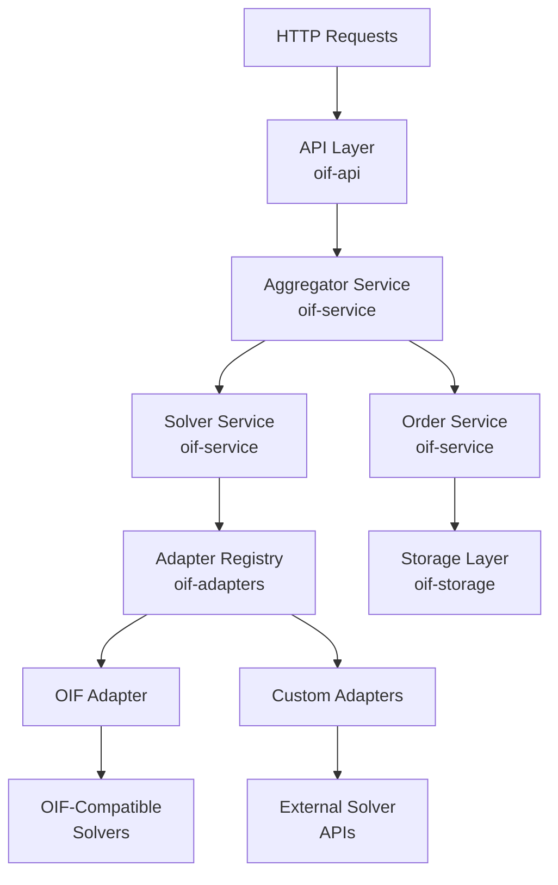

# Architecture

The OIF Aggregator follows a modular, crate-based architecture with clear separation of concerns.

## Diagram

## Crate Structure

- `crates/types/` : Core domain models and types
- `crates/service/` : Business logic and aggregation
- `crates/api/` : HTTP API and routing
- `crates/storage/` : Storage abstractions and implementations
- `crates/adapters/` : Solver adapter implementations
- `crates/config/` : Configuration loading and management
- `config/` : JSON configuration
- `examples/` : Usage examples and demos
- `src/` : Main library and binary

## Key Components

- `AggregatorService` - Core quote aggregation logic
- `OrderService` - Intent submission and tracking
- `SolverService` - Solver management and discovery
- `CircuitBreakerService` - Automatic failure protection and recovery
- `SolverFilterService` - Smart solver selection and filtering
- `AdapterRegistry` - Manages protocol adapters (OIF, custom)
- `Storage` - Trait for persistence (memory, Redis)
- `IntegrityService` - HMAC-SHA256 quote verification
- `BackgroundJobHandler` - Async metrics processing and state management