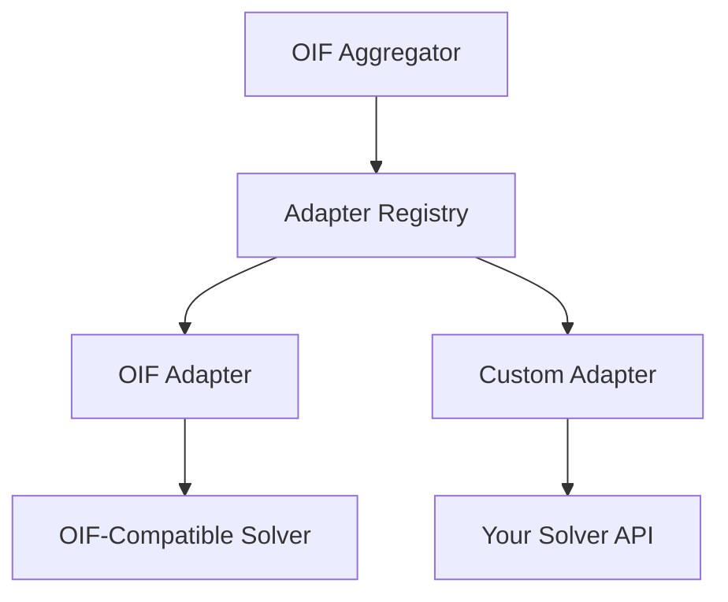
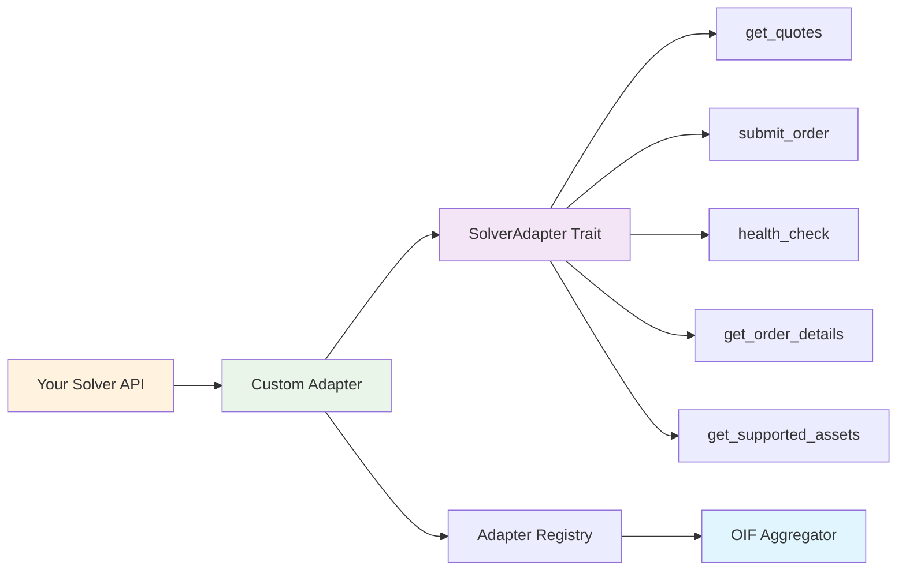

## Overview

Adapters serve as the bridge between the OIF Aggregator and external solver protocols. They translate standard OIF requests into solver-specific API calls and convert responses back to the OIF standard.

### Architecture



### Custom Adapter Integration Points



---

## Implementing a Custom Adapter

### Reference Implementations

Before starting, review the reference adapters in `crates/adapters/src/`:

- `oif_adapter.rs` — Standard OIF protocol adapter  
- `across_adapter.rs` — Across Protocol integration ([guide](./across-adapter))  
- `mod.rs` — Adapter registry and factory patterns  

These show examples of:
- HTTP client setup and error handling  
- Request/response transformation  
- Authentication handling  
- Timeout and retry strategies  
- Testing and mocking patterns  

---

### 1. Dependencies

```toml
[dependencies]
oif-types = { path = "../oif-aggregator/crates/types" }
async-trait = "0.1"
serde = { version = "1.0", features = ["derive"] }
serde_json = "1.0"
reqwest = { version = "0.11", features = ["json"] }
tokio = { version = "1.0", features = ["full"] }
```

---

### 2. Basic Adapter Structure

```rust
use async_trait::async_trait;
use oif_types::{
    adapters::{traits::SolverAdapter, SolverRuntimeConfig, AdapterResult},
    models::{Asset, Network},
    Adapter, OifGetQuoteRequest, OifGetQuoteResponse, OifPostOrderRequest, OifPostOrderResponse, OifGetOrderResponse,
};

#[derive(Debug)]
pub struct MyCustomAdapter {
    adapter_info: Adapter,
    client: reqwest::Client,
}

impl MyCustomAdapter {
    pub fn new() -> Self {
        let adapter_info = Adapter::new(
            "my-custom-v1".to_string(),
            "Custom adapter for My Solver".to_string(),
            "My Custom Adapter".to_string(),
            "1.0.0".to_string(),
        );

        Self {
            adapter_info,
            client: reqwest::Client::new(),
        }
    }
}

#[async_trait]
impl SolverAdapter for MyCustomAdapter {
    fn adapter_info(&self) -> &Adapter {
        &self.adapter_info
    }

    async fn get_quotes(
        &self,
        request: &OifGetQuoteRequest,
        config: &SolverRuntimeConfig,
    ) -> AdapterResult<OifGetQuoteResponse> {
        todo!("Implement quote fetching logic")
    }

    async fn submit_order(
        &self,
        order: &OifPostOrderRequest,
        config: &SolverRuntimeConfig,
    ) -> AdapterResult<OifPostOrderResponse> {
        todo!("Implement order submission logic")
    }

    async fn health_check(&self, config: &SolverRuntimeConfig) -> AdapterResult<bool> {
        todo!("Implement health check logic")
    }

    async fn get_order_details(
        &self,
        order_id: &str,
        config: &SolverRuntimeConfig,
    ) -> AdapterResult<OifGetOrderResponse> {
        todo!("Implement order details fetching logic")
    }

    async fn get_supported_assets(
        &self,
        config: &SolverRuntimeConfig,
    ) -> AdapterResult<SupportedAssetsData> {
        // Assets mode example
        let assets = vec![/* fetch from API */];
        Ok(SupportedAssetsData::Assets(assets))
    }
}
```

---

## Choosing Assets vs Routes Mode

<Callout type="info">
Use **Assets Mode** for DEX/Swap protocols and **Routes Mode** for bridges or restricted route solvers.
</Callout>

**Assets Mode —** Any-to-any support: ideal for DEXes.  
**Routes Mode —** Precise origin→destination routes: ideal for bridges.

---

## Registration and Configuration

### 1. Register Your Adapter

```rust
use oif_aggregator::AggregatorBuilder;
use oif_types::solvers::Solver;

#[tokio::main]
async fn main() -> Result<(), Box<dyn std::error::Error>> {
    let custom_adapter = MyCustomAdapter::new();

    let custom_solver = Solver::new(
        "my-custom-solver".to_string(),
        "my-custom-v1".to_string(),
        "https://api.my-solver.com".to_string(),
    );

    let (_app, _state) = AggregatorBuilder::default()
        .with_adapter(Box::new(custom_adapter))
        .with_solver(custom_solver)
        .start()
        .await?;

    Ok(())
}
```

---

### 2. Configuration File

```json
{
  "solvers": {
    "my-solver": {
      "solver_id": "my-solver",
      "adapter_id": "my-custom-v1",
      "endpoint": "https://api.mysolver.com/v1",
      "enabled": true,
      "headers": {
        "Authorization": "Bearer your-api-key"
      },
      "adapter_metadata": {
        "custom_feature": true
      },
      "name": "My Custom Solver",
      "description": "Integration with My Custom Solver"
    }
  }
}
```

---

### 3. Adapter Metadata Configuration

```rust
#[async_trait]
impl SolverAdapter for MyCustomAdapter {
    async fn get_quotes(
        &self,
        request: &OifGetQuoteRequest,
        config: &SolverRuntimeConfig,
    ) -> AdapterResult<OifGetQuoteResponse> {
        if let Some(metadata) = &config.adapter_metadata {
            let timeout = metadata.get("timeout_ms")
                .and_then(|v| v.as_u64())
                .unwrap_or(5000);

            let client = reqwest::Client::builder()
                .timeout(std::time::Duration::from_millis(timeout))
                .build()?;
        }
        todo!()
    }
}
```

---

## Advanced Features

### HTTP Client Caching

```rust
use oif_adapters::{ClientCache, ClientConfig};
use std::sync::Arc;

#[derive(Debug)]
pub struct MyCustomAdapter {
    adapter_info: Adapter,
    cache: ClientCache,
}

impl MyCustomAdapter {
    pub fn new() -> Self {
        Self {
            adapter_info: Adapter::new(
                "my-custom-v1".to_string(),
                "Custom adapter with caching".to_string(),
                "My Custom Adapter".to_string(),
                "1.0.0".to_string(),
            ),
            cache: ClientCache::for_adapter(),
        }
    }

    fn get_client(&self, solver_config: &SolverRuntimeConfig) -> AdapterResult<Arc<reqwest::Client>> {
        let client_config = ClientConfig::from(solver_config);
        self.cache.get_client(&client_config)
    }
}
```

**Benefits:**
- Connection pooling  
- Automatic reuse and cleanup  
- Authentication header support  
- Thread-safe concurrency  

---

## Reference Implementations

- `crates/adapters/src/oif_adapter.rs` — [OIF Adapter Guide](./adapters/oif-adapter)  
- `crates/adapters/src/across_adapter.rs` — [Across Adapter Guide](./adapters/across-adapter)  

<Callout type="info">
💡 Need Help? Check existing adapters or open a GitHub issue for support.
</Callout>
