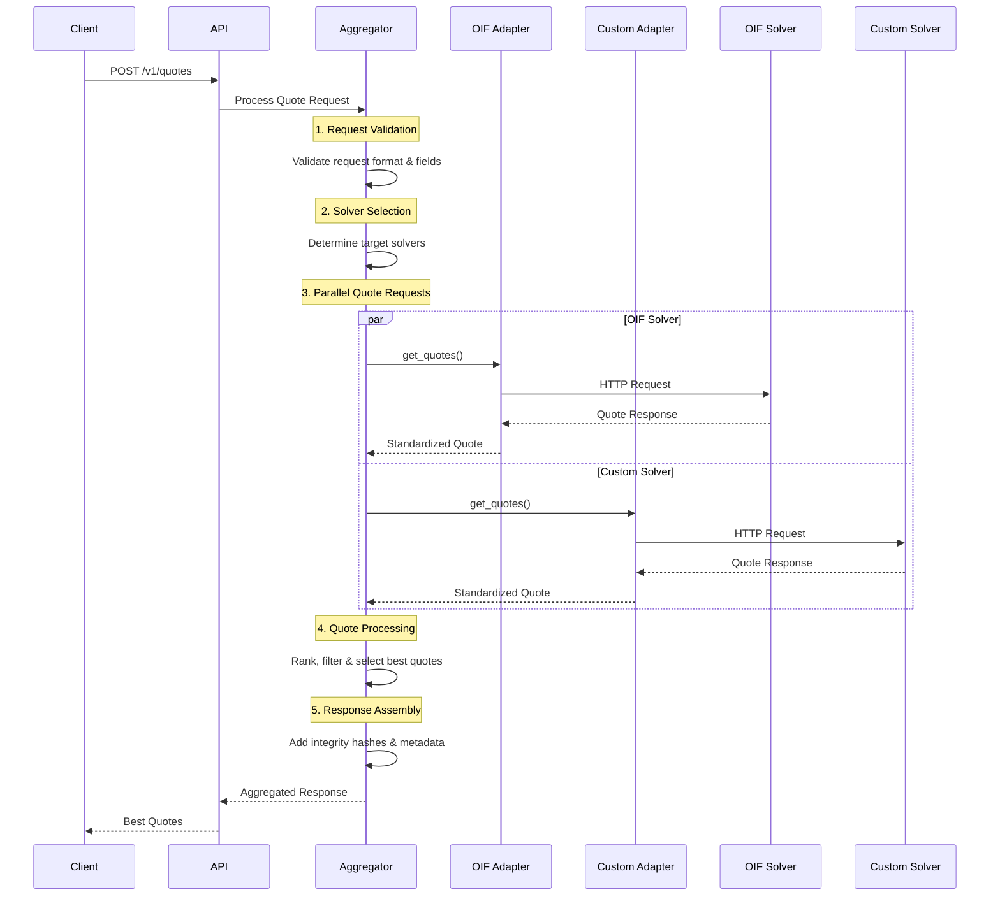

## Overview

The OIF Aggregator collects quotes from multiple DeFi solvers and presents them in a unified format. This allows users to compare options across different protocols and chains to find the best execution path for their intents.

---

## Quotes Endpoint

### `POST /v1/quotes`

Request quotes from multiple solvers.

#### Request Format (OIF v0 Standard)

```json
{
  "user": "0x01000002147a6970997970C51812dc3A010C7d01b50e0d17dc79C8",
  "intent": {
    "intentType": "oif-swap",
    "inputs": [
      {
        "user": "0x01000002147a6970997970C51812dc3A010C7d01b50e0d17dc79C8",
        "asset": "0x01000002147a695FbDB2315678afecb367f032d93F642f64180aa3",
        "amount": "1000000000000000000"
      }
    ],
    "outputs": [
      {
        "receiver": "0x01000002147a6a3C44CdDdB6a900fa2b585dd299e03d12FA4293BC",
        "asset": "0x01000002147a6a5FbDB2315678afecb367f032d93F642f64180aa3",
        "amount": "1000000000000000000"
      }
    ],
    "swapType": "exact-input",
    "minValidUntil": 600,
    "preference": "speed",
    "partialFill": false
  },
  "supportedTypes": ["oif-escrow-v0"],
  "solverOptions": {
    "timeout": 4000,
    "solverTimeout": 2000
  }
}
```

---

## Solver Options Configuration

The `solverOptions` object provides fine-grained control over solver selection and aggregation behavior.

```json
{
  "solverOptions": {
    "includeSolvers": ["solver-oif-1", "solver-oif-2"],
    "excludeSolvers": ["unreliable-solver"],
    "timeout": 8000,
    "solverTimeout": 3000,
    "minQuotes": 2,
    "solverSelection": "all",
    "sampleSize": 10,
    "priorityThreshold": 75
  }
}
```

| Field | Type | Default | Range | Description |
|-------|------|---------|-------|-------------|
| `includeSolvers` | `array<string>` | All enabled | - | Specific solver IDs to include |
| `excludeSolvers` | `array<string>` | None | - | Solver IDs to exclude |
| `timeout` | `number` | 10000ms | 100–60000 | Global timeout |
| `solverTimeout` | `number` | 5000ms | 100–30000 | Per solver timeout |
| `minQuotes` | `number` | 30 | 1+ | Minimum valid quotes |
| `solverSelection` | `string` | "all" | "all", "sampled", "priority" | Solver selection mode |
| `sampleSize` | `number` | 30 | 1+ | Sample size |
| `priorityThreshold` | `number` | 0 | 0–100 | Confidence threshold |

---

## Aggregation Process

The quote aggregation follows a structured pipeline to deliver the best quotes from multiple solvers.



---

## Configuration Options

### Aggregation Settings

| Setting | Description | Default | Range |
|---------|-------------|---------|-------|
| `global_timeout_ms` | Total timeout for aggregation request | 5000ms | 1000–30000 |
| `per_solver_timeout_ms` | Timeout per solver | 2000ms | 500–10000 |
| `max_concurrent_solvers` | Max parallel solvers | 50 | 1–50 |
| `max_retries_per_solver` | Retry attempts | 2 | 0–3 |
| `retry_delay_ms` | Delay between retries | 100ms | 100–5000 |
| `include_unknown_compatibility` | Include solvers with unknown compatibility | false | boolean |

```json
{
  "aggregation": {
    "global_timeout_ms": 5000,
    "per_solver_timeout_ms": 2000,
    "max_concurrent_solvers": 50,
    "max_retries_per_solver": 2,
    "retry_delay_ms": 100,
    "include_unknown_compatibility": false
  }
}
```

<Callout type="info">
Runtime `solverOptions` in quote requests override these system defaults defined in configuration.
</Callout>
