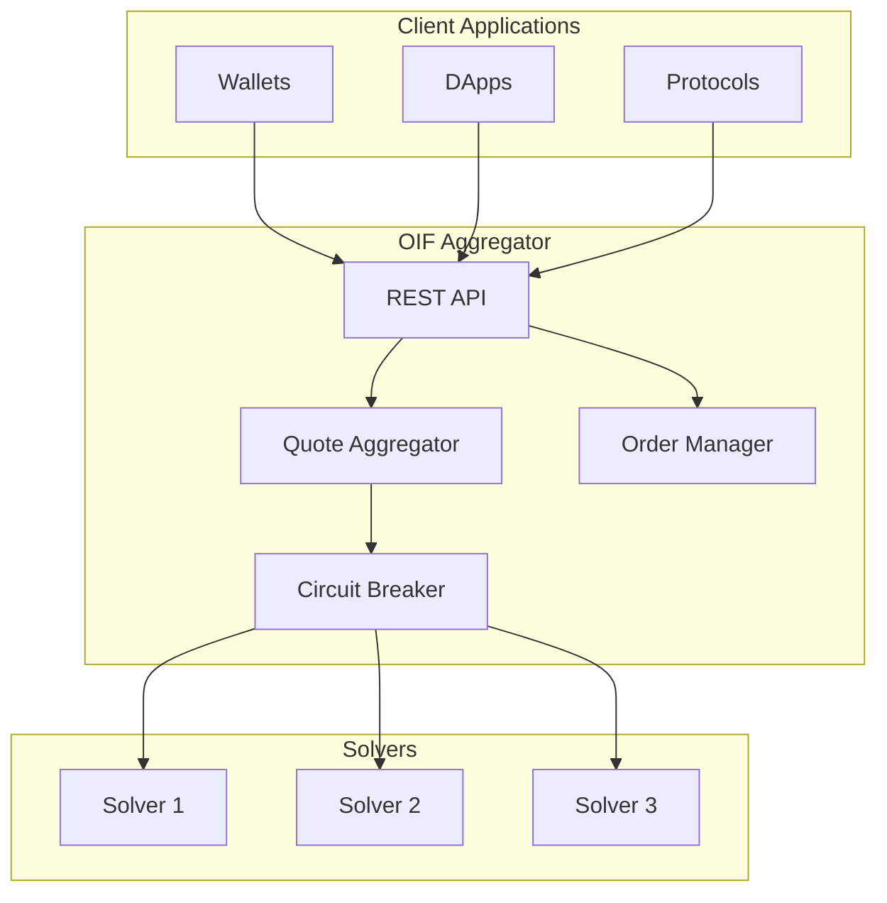

# Aggregators

Welcome to the OIF Aggregators documentation. The OIF Aggregator is a high-performance service for aggregating quotes from multiple solvers, managing intent submission, and tracking order execution.

## What is the OIF Aggregator?

The OIF Aggregator acts as a central hub that:
- **Aggregates Quotes**: Fetches and compares quotes from multiple solvers concurrently
- **Routes Orders**: Directs user intents to the best-performing solvers
- **Tracks Execution**: Monitors order status from submission to settlement
- **Ensures Integrity**: Validates quotes and prevents tampering using HMAC-SHA256

## Why Run an Aggregator?

Running your own aggregator provides:

- **Control**: Full control over solver selection and routing logic
- **Privacy**: Keep user intents private within your infrastructure
- **Customization**: Implement custom quote selection and solver scoring
- **Reliability**: Eliminate dependence on third-party aggregators

## Key Features

### Core Capabilities
- Multi-solver quote aggregation with concurrent fetching
- ERC-7930 compliance (Open Intent Framework standard)
- Intent-based architecture with full lifecycle tracking
- HMAC-SHA256 integrity verification for quotes
- Circuit breaker protection for failing solvers
- Real-time solver performance monitoring

### Performance & Reliability
- Built in Rust with Tokio async runtime
- Circuit breaker pattern prevents cascading failures
- Smart solver filtering based on health metrics
- Comprehensive error handling and recovery
- Structured logging (JSON and pretty-print)

### Extensibility
- Custom adapter system for new solver protocols
- Pluggable authentication strategies
- Configurable timeouts and retry policies
- Builder pattern for flexible configuration

## Getting Started

<Cards>
  <Card title="Overview" href="/docs/aggregators/overview" description="Learn about aggregator architecture" />
  <Card title="Quickstart" href="/docs/aggregators/quickstart" description="Run your first aggregator in minutes" />
  <Card title="Configuration" href="/docs/aggregators/configuration" description="Configure solvers, auth, and settings" />
  <Card title="Architecture" href="/docs/aggregators/architecture" description="Deep dive into design and components" />
</Cards>

## Architecture Overview

## API Endpoints

The aggregator exposes a RESTful API:

- `GET /health` - Health check endpoint
- `POST /v1/quotes` - Request quotes from multiple solvers
- `POST /v1/orders` - Submit order for execution
- `GET /v1/orders/:id` - Get order status
- `GET /v1/solvers` - List all registered solvers
- `GET /v1/solvers/:id` - Get solver details and health

See the [API Reference](/docs/apis) for detailed documentation.

## Use Cases

### For Wallet Developers
Integrate the aggregator to offer users:
- Best execution prices across multiple solvers
- Seamless cross-chain swaps
- Real-time quote comparison

### For Protocols
Deploy a custom aggregator to:
- Control solver selection logic
- Implement custom routing strategies
- Maintain privacy for user transactions

### For DApp Builders
Use the aggregator to:
- Power cross-chain features
- Simplify user experience
- Reduce integration complexity

## Technology Stack

- **Language**: Rust 🦀
- **Framework**: Axum web framework
- **Runtime**: Tokio async runtime
- **Standards**: ERC-7930, EIP-7683
- **API**: RESTful HTTP/JSON

## Next Steps

1. Read the [Overview](/docs/aggregators/overview) to understand the architecture
2. Follow the [Quickstart](/docs/aggregators/quickstart) to run your first aggregator
3. Configure solvers using the [Configuration Guide](/docs/aggregators/configuration)
4. Explore the [API Reference](/docs/apis) for integration details

Ready to start? Head to the [Quickstart Guide](/docs/aggregators/quickstart)!

