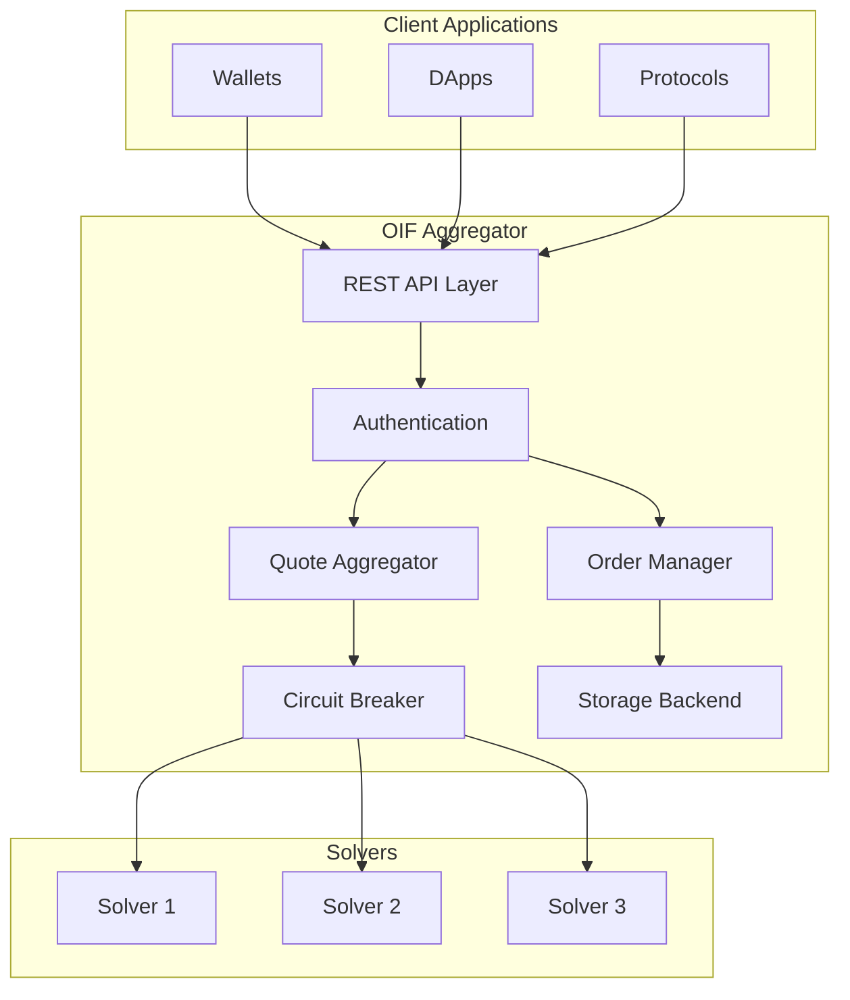

# OIF Aggregator Overview

The OIF Aggregator is a high-performance service for aggregating quotes from multiple solvers, managing intent submission, and tracking order execution. It acts as the central routing layer between users and solvers in the Open Intents Framework.

## What is the OIF Aggregator?

The OIF Aggregator acts as a central hub that:

- **Aggregates Quotes**: Fetches and compares quotes from multiple solvers concurrently
- **Routes Orders**: Directs user intents to the best-performing solvers
- **Tracks Execution**: Monitors order status from submission to settlement
- **Ensures Integrity**: Validates quotes and prevents tampering using HMAC-SHA256

## Features

### Core Capabilities

- **Multi-Solver Quote Aggregation**: Fetch quotes from multiple DeFi solvers concurrently
- **ERC-7930 Compliance**: Full support for the Open Intent Framework standard
- **Intent-Based Architecture**: Submit intents and track execution through to settlement
- **Integrity Verification**: HMAC-SHA256 checksums prevent quote tampering
- **Circuit Breaker Protection**: Automatic failure detection and recovery for failing solvers
- **Performance Metrics**: Real-time solver performance monitoring and analytics
- **Flexible Storage**: In-memory storage backend with pluggable architecture
- **Rate Limiting**: Built-in IP-based rate limiting for API protection

### Extensibility

- **Custom Adapters**: Easily integrate new solver protocols
- **Builder Pattern**: Flexible programmatic configuration
- **Pluggable Authentication**: Multiple auth strategies (API keys, none, custom)
- **Configurable Timeouts**: Per-solver and global timeout management

### Performance & Reliability

- **Async/Await**: Built on Tokio for high concurrency
- **Circuit Breaker Pattern**: Prevents cascading failures with exponential backoff
- **Solver Health Monitoring**: Real-time success rates and error tracking
- **Smart Filtering**: Intelligent solver selection based on performance metrics
- **Error Handling**: Comprehensive error types and recovery mechanisms
- **Structured Logging**: JSON and pretty-print log formats for easy debugging

## Architecture



### Component Breakdown

#### REST API Layer

- Exposes HTTP/JSON endpoints for client integration
- Handles request validation and response formatting
- Provides OpenAPI/Swagger documentation (optional feature)

#### Authentication System

- API key management and validation
- Request signing and verification
- Rate limiting per client/IP

#### Quote Aggregator

- Parallel quote requests to multiple solvers
- Response collection and ranking
- Timeout management and error handling

#### Circuit Breaker

- Monitors solver health and success rates
- Automatically disables failing solvers
- Implements exponential backoff for recovery

#### Order Manager

- Tracks order lifecycle from submission to settlement
- Routes orders to selected solvers
- Provides status updates and history

#### Storage Backend

- In-memory storage for orders and solver state
- Pluggable architecture for custom storage implementations
- Fast access with minimal overhead

## API Endpoints

The aggregator exposes a RESTful API:

### Core Endpoints

- `GET /health` - Health check endpoint for monitoring
- `POST /v1/quotes` - Request quotes from multiple solvers
- `POST /v1/orders` - Submit signed order for execution
- `GET /v1/orders/:id` - Retrieve order status and history
- `GET /v1/solvers` - List all registered solvers with health metrics
- `GET /v1/solvers/:id` - Get detailed solver information and statistics

### Optional Endpoints

- `GET /swagger-ui` - Interactive Swagger UI (requires `openapi` feature)
- `GET /api-docs/openapi.json` - OpenAPI 3.0 specification (requires `openapi` feature)

See the [API Reference](/docs/apis) for detailed documentation on request/response formats, authentication, and error handling.

## Use Cases

### For Wallet Developers

Integrate the aggregator to offer users:

- **Best Execution**: Compare prices across multiple solvers automatically
- **Seamless UX**: Simple REST API eliminates complexity
- **Real-Time Quotes**: Fast quote aggregation with configurable timeouts
- **Order Tracking**: Monitor execution status through settlement

### For Protocol Teams

Deploy a custom aggregator to:

- **Control Solver Set**: Choose which solvers to include
- **Custom Routing**: Implement protocol-specific selection logic
- **Privacy**: Keep transaction data within your infrastructure
- **Branding**: White-label the aggregator for your protocol

### For DApp Builders

Use the aggregator to:

- **Add Cross-Chain**: Power cross-chain swaps without custom infrastructure
- **Reduce Complexity**: Single API instead of multiple solver integrations
- **Save Time**: Pre-built solution vs building from scratch
- **Stay Updated**: Automatic support for new solvers added to network

## Technology Stack

- **Language**: Rust 🦀
  - Memory safety and high performance
  - Strong typing and error handling
  - Excellent async runtime support

- **Framework**: Axum web framework
  - Fast, ergonomic HTTP server
  - Tower middleware ecosystem
  - Built on Tokio async runtime

- **Runtime**: Tokio async runtime
  - High-performance async I/O
  - Efficient task scheduling
  - Cross-platform support

- **Standards**: ERC-7930, EIP-7683
  - Open Intent Framework API standard
  - Cross-Chain Intents Standard
  - Interoperability with ecosystem

- **API**: RESTful HTTP/JSON
  - Standard HTTP methods
  - JSON request/response format
  - OpenAPI 3.0 specification support

## Configuration

The aggregator is configured via `config.json`:

```json
{
  "server": {
    "host": "0.0.0.0",
    "port": 3000
  },
  "solvers": [
    {
      "id": "solver-1",
      "name": "Example Solver",
      "base_url": "http://localhost:4000",
      "timeout_ms": 5000
    }
  ],
  "authentication": {
    "enabled": true,
    "api_keys": ["key1", "key2"]
  },
  "rate_limiting": {
    "enabled": true,
    "requests_per_minute": 100
  }
}
```

See [Configuration Guide](/docs/aggregators/configuration) for complete details.

## Solver Health & Circuit Breaker

The aggregator monitors solver health and automatically disables failing solvers:

### Health Metrics

- Success rate (successful quotes / total requests)
- Average response time
- Recent error count
- Consecutive failure count

### Circuit Breaker States

1. **Closed** (Normal): Solver is healthy, all requests allowed
2. **Open** (Failed): Solver has failed, all requests blocked temporarily
3. **Half-Open** (Recovery): Testing if solver has recovered

### Recovery Strategy

- Exponential backoff between retry attempts
- Automatic re-enabling after recovery confirmation
- Configurable failure thresholds and backoff parameters

## Security Considerations

### Quote Integrity

- All quotes include HMAC-SHA256 checksums
- Prevents tampering during transmission
- Verifiable by end users

### Authentication

- Optional API key authentication
- Per-client rate limiting
- IP-based restrictions

### Input Validation

- Strict request schema validation
- Address format verification (EIP-7930)
- Amount and timing sanity checks

## Deployment Options

### Standalone Binary

```bash
cargo build --release
./target/release/oif-aggregator
```

### Docker Container

```bash
docker build -t oif-aggregator .
docker run -p 4000:4000 -e INTEGRITY_SECRET=your-secret-here oif-aggregator
```

### Cloud Deployment

- Compatible with any cloud provider
- Stateless design enables horizontal scaling
- Health endpoint for load balancer checks

See [Deployment Guide](/docs/aggregators/quickstart) for detailed instructions.

## Monitoring & Observability

### Structured Logging

Inside `config.json` file you can change the way we show the logs inside terminal:

```bash
# JSON format for machine parsing
"logging": {
    "level": "debug",
    "format": "compact",
    "structured": false
},

# Pretty format for human reading
"logging": {
    "level": "debug",
    "format": "pretty",
    "structured": false
},
```

Then you can see the logs by running:

```bash
RUST_LOG=info ./target/release/oif-aggregator
```

### Health Checks

```bash
curl http://localhost:3000/health
```

Response includes:

- Service status
- Solver health metrics
- Storage statistics

### Metrics (Coming Soon)

- Prometheus endpoint for metrics export
- Request rates and latencies
- Solver performance statistics

## Next Steps

1. **Deploy Locally**: Follow the [Quickstart Guide](/docs/aggregators/quickstart)
2. **Configure Solvers**: Read the [Configuration Guide](/docs/aggregators/configuration)
3. **Understand Architecture**: Explore [Architecture Details](/docs/aggregators/architecture)
4. **Build Custom Adapter**: See [Custom Adapter Guide](/docs/aggregators/custom-adapter)
5. **Integrate APIs**: Check [API Documentation](/docs/apis)

## Additional Resources

- [GitHub Repository](https://github.com/openintentsframework/oif-aggregator)
- [API Documentation](/docs/apis)
- [Solver Documentation](/docs/solvers)
- [Smart Contracts](/docs/smart-contracts)
