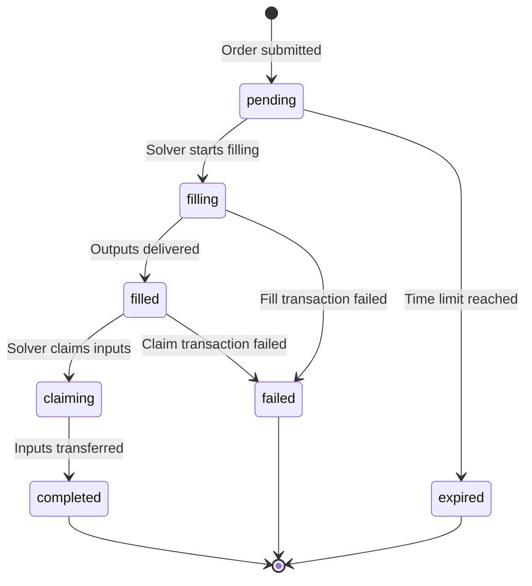

# Orders API

The Orders API allows you to submit signed intents for execution and track their status through completion.

## Endpoints

### Submit Order
```
POST /v1/orders
```

### Get Order Status
```
GET /v1/orders/:id
```

## Submit Order

### Request Format

```typescript
{
  quoteId: string;           // Quote ID from /v1/quotes
  signature: string;         // User's signature (0x-prefixed hex)
  userAddress: Address;      // User's address (EIP-7930 format)
}
```

### Example Request

```bash
curl -X POST http://localhost:3000/v1/orders \
  -H "Content-Type: application/json" \
  -d '{
    "quoteId": "quote_abc123xyz",
    "signature": "0x1234567890abcdef...",
    "userAddress": "0x00010000010114D8DA6BF26964AF9D7EED9E03E53415D37AA96045"
  }'
```

### Success Response (200 OK)

```json
{
  "orderId": "order_xyz789",
  "status": "pending",
  "quoteId": "quote_abc123xyz",
  "solverId": "solver-1",
  "userAddress": "0x00010000010114D8DA6BF26964AF9D7EED9E03E53415D37AA96045",
  "inputs": [{
    "user": "0x00010000010114D8DA6BF26964AF9D7EED9E03E53415D37AA96045",
    "asset": "0x000100000101A0b86991c6218b36c1d19D4a2e9Eb0cE3606eB48",
    "amount": "1000000000"
  }],
  "outputs": [{
    "receiver": "0x00010000010114D8DA6BF26964AF9D7EED9E03E53415D37AA96045",
    "asset": "0x000100000101C02aaA39b223FE8D0A0e5C4F27eAD9083C756Cc2",
    "amount": "400000000000000000"
  }],
  "createdAt": 1703123456,
  "expiresAt": 1703123756,
  "fillTxHash": null,
  "claimTxHash": null
}
```

### Error Responses

#### Quote Not Found (404)
```json
{
  "error": "QUOTE_NOT_FOUND",
  "message": "Quote quote_abc123 not found",
  "timestamp": 1703123456
}
```

#### Quote Expired (400)
```json
{
  "error": "QUOTE_EXPIRED",
  "message": "Quote quote_abc123 has expired",
  "timestamp": 1703123456
}
```

#### Validation Error (400)
```json
{
  "error": "VALIDATION_ERROR",
  "message": "Invalid signature",
  "timestamp": 1703123456
}
```

## Get Order Status

### Request Format

```bash
GET /v1/orders/:orderId
```

### Example Request

```bash
curl http://localhost:3000/v1/orders/order_xyz789
```

### Success Response (200 OK)

```json
{
  "orderId": "order_xyz789",
  "status": "filled",
  "quoteId": "quote_abc123xyz",
  "solverId": "solver-1",
  "userAddress": "0x00010000010114D8DA6BF26964AF9D7EED9E03E53415D37AA96045",
  "inputs": [...],
  "outputs": [...],
  "createdAt": 1703123456,
  "expiresAt": 1703123756,
  "fillTxHash": "0xabc123...",
  "claimTxHash": "0xdef456...",
  "executionDetails": {
    "filledAt": 1703123486,
    "claimedAt": 1703123516,
    "gasUsed": "150000",
    "totalDuration": 60
  }
}
```

### Error Response (404)

```json
{
  "error": "ORDER_NOT_FOUND",
  "message": "Order order_xyz789 not found",
  "timestamp": 1703123456
}
```

## Order Status Flow



## Order Statuses

| Status | Description | Next Steps |
|--------|-------------|------------|
| `pending` | Order created, awaiting execution | Wait for solver to begin |
| `filling` | Solver delivering outputs | Monitor fill transaction |
| `filled` | Outputs delivered successfully | Solver will claim inputs |
| `claiming` | Solver claiming input assets | Monitor claim transaction |
| `completed` | Fully executed successfully | No action needed |
| `failed` | Execution failed | Check error, may retry |
| `expired` | Expired before execution | Refund initiated |

## Response Fields

### Order Object

| Field | Type | Description |
|-------|------|-------------|
| `orderId` | string | Unique order identifier |
| `status` | string | Current order status |
| `quoteId` | string | Associated quote ID |
| `solverId` | string | Executing solver ID |
| `userAddress` | Address | User's address |
| `inputs` | Input[] | Input assets being provided |
| `outputs` | Output[] | Output assets being received |
| `createdAt` | number | Creation timestamp |
| `expiresAt` | number | Expiration timestamp |
| `fillTxHash` | string\|null | Output fill transaction hash |
| `claimTxHash` | string\|null | Input claim transaction hash |
| `executionDetails` | object\|null | Execution timing details |

### Execution Details

| Field | Type | Description |
|-------|------|-------------|
| `filledAt` | number | When outputs were filled |
| `claimedAt` | number | When inputs were claimed |
| `gasUsed` | string | Total gas used |
| `totalDuration` | number | Seconds from submit to complete |

## Complete Example Flow

### Step 1: Get Quotes

```bash
curl -X POST http://localhost:3000/v1/quotes \
  -H "Content-Type: application/json" \
  -d '{
    "user": "0x00010000010114D8DA6BF26964AF9D7EED9E03E53415D37AA96045",
    "intent": {
      "intentType": "oif-swap",
      "inputs": [{
        "user": "0x00010000010114D8DA6BF26964AF9D7EED9E03E53415D37AA96045",
        "asset": "0x000100000101A0b86991c6218b36c1d19D4a2e9Eb0cE3606eB48",
        "amount": "1000000000"
      }],
      "outputs": [{
        "receiver": "0x00010000010114D8DA6BF26964AF9D7EED9E03E53415D37AA96045",
        "asset": "0x000100000101C02aaA39b223FE8D0A0e5C4F27eAD9083C756Cc2"
      }]
    },
    "swapType": "exact-input"
  }'
```

### Step 2: Sign Quote

```typescript
import { ethers } from 'ethers';

const quote = quotesResponse.quotes[0];
const message = ethers.utils.keccak256(
  ethers.utils.defaultAbiCoder.encode(
    ['string', 'string', 'uint256'],
    [quote.quoteId, user.address, quote.expiresAt]
  )
);

const signature = await signer.signMessage(ethers.utils.arrayify(message));
```

### Step 3: Submit Order

```bash
curl -X POST http://localhost:3000/v1/orders \
  -H "Content-Type: application/json" \
  -d '{
    "quoteId": "quote_abc123xyz",
    "signature": "0x1234567890abcdef...",
    "userAddress": "0x00010000010114D8DA6BF26964AF9D7EED9E03E53415D37AA96045"
  }'
```

### Step 4: Poll for Status

```bash
# Poll every 5 seconds
while true; do
  curl http://localhost:3000/v1/orders/order_xyz789
  sleep 5
done
```

## Error Codes

| Code | HTTP Status | Description | Action |
|------|-------------|-------------|--------|
| `VALIDATION_ERROR` | 400 | Invalid request data | Fix request and retry |
| `QUOTE_NOT_FOUND` | 404 | Quote doesn't exist | Request new quotes |
| `QUOTE_EXPIRED` | 400 | Quote has expired | Request new quotes |
| `STORAGE_ERROR` | 500 | Database error | Retry after delay |
| `SOLVER_ADAPTER_ERROR` | 502 | Solver communication failed | Check solver status |
| `ORDER_NOT_FOUND` | 404 | Order doesn't exist | Verify order ID |
| `CONVERSION_ERROR` | 500 | Internal conversion error | Contact support |

## Best Practices

### 1. Validate Quote Before Submission

```typescript
const now = Math.floor(Date.now() / 1000);
if (quote.expiresAt < now) {
  throw new Error('Quote expired, request new quotes');
}

// Verify integrity checksum
if (!verifyIntegrity(quote, secret)) {
  throw new Error('Quote integrity check failed');
}
```

### 2. Proper Signature Generation

```typescript
// Use EIP-191 signed message
const messageHash = ethers.utils.hashMessage(quoteId);
const signature = await signer.signMessage(quoteId);
```

### 3. Implement Status Polling

```typescript
async function waitForCompletion(orderId, maxWaitSeconds = 300) {
  const startTime = Date.now();
  
  while ((Date.now() - startTime) / 1000 < maxWaitSeconds) {
    const order = await getOrder(orderId);
    
    if (order.status === 'completed') {
      return order;
    }
    
    if (order.status === 'failed' || order.status === 'expired') {
      throw new Error(`Order ${order.status}: ${order.error}`);
    }
    
    await sleep(5000); // Poll every 5 seconds
  }
  
  throw new Error('Order execution timeout');
}
```

### 4. Handle Expiration

```typescript
const order = await submitOrder(quoteId, signature, userAddress);

// Set up expiration handler
setTimeout(() => {
  checkOrderStatus(order.orderId).then(status => {
    if (status === 'expired') {
      console.log('Order expired, initiate refund');
    }
  });
}, (order.expiresAt - Date.now() / 1000) * 1000);
```

### 5. Monitor Transactions

```typescript
if (order.fillTxHash) {
  // Monitor fill transaction
  const fillReceipt = await provider.waitForTransaction(order.fillTxHash);
  console.log(`Fill confirmed in block ${fillReceipt.blockNumber}`);
}

if (order.claimTxHash) {
  // Monitor claim transaction
  const claimReceipt = await provider.waitForTransaction(order.claimTxHash);
  console.log(`Claim confirmed in block ${claimReceipt.blockNumber}`);
}
```

## Webhooks (Future)

Webhook support for order status updates is planned:

```typescript
{
  "webhookUrl": "https://your-app.com/webhooks/oif",
  "events": ["order.filled", "order.completed", "order.failed"]
}
```

## Rate Limits

- **POST /v1/orders**: 10 requests/minute per IP
- **GET /v1/orders/:id**: 100 requests/minute per IP

See [Rate Limits](/docs/apis/rate-limits) for details.

## Next Steps

- See [Complete Examples](/docs/apis/examples)
- Learn about [Error Handling](/docs/apis/errors)
- Check [Solver API](/docs/apis/solver-api) for solver discovery

