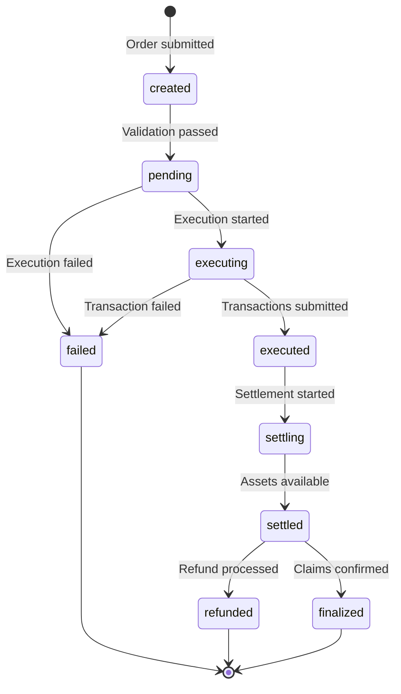

# Orders API

The Orders API allows you to submit signed intents for execution and track their status through completion.

## Endpoints

### Submit Order
```
POST /v1/orders
```

### Get Order Status
```
GET /v1/orders/:id
```

## Submit Order

### Request Format

```typescript
{
  order: Order;              // The order object from the quote response
  signature: Hex;            // EIP-712 signature (hex string in JSON)
  quoteId?: string;          // Optional quote ID for tracking
  originSubmission?: {       // Optional submission preference
    mode: "user" | "protocol";
    schemes?: Array<"erc-4337" | "permit2" | "erc20-permit" | "eip-3009">;
  };
}
```

The `order` field contains the complete order object from the quote response, including EIP-712 typed data that the user signs.

### Example Request

```bash
curl -X POST http://localhost:3000/v1/orders \
  -H "Content-Type: application/json" \
  -d '{
    "quoteId": "quote_abc123xyz",
    "order": {
      "type": "oif-escrow-v0",
      "payload": {
        "signatureType": "eip712",
        "domain": { ... },
        "primaryType": "PermitBatchWitnessTransferFrom",
        "types": { ... },
        "message": { ... }
      }
    },
    "signature": "0x1234567890abcdef..."
  }'
```

### Success Response (200 OK)

```json
{
  "orderId": "order_xyz789",
  "status": "received",
  "message": "Order accepted for processing"
}
```

The `status` field can be:
- `"received"`: Order accepted and queued for processing
- `"rejected"`: Order failed validation (bad signature, expired, etc.)
- `"error"`: Unexpected server error

### Error Responses

#### Quote Not Found (404)
```json
{
  "error": "QUOTE_NOT_FOUND",
  "message": "Quote quote_abc123 not found",
  "timestamp": 1703123456
}
```

#### Quote Expired (400)
```json
{
  "error": "QUOTE_EXPIRED",
  "message": "Quote quote_abc123 has expired",
  "timestamp": 1703123456
}
```

#### Validation Error (400)
```json
{
  "error": "VALIDATION_ERROR",
  "message": "Invalid signature",
  "timestamp": 1703123456
}
```

## Get Order Status

### Request Format

```bash
GET /v1/orders/:orderId
```

### Example Request

```bash
curl http://localhost:3000/v1/orders/order_xyz789
```

### Success Response (200 OK)

```json
{
  "id": "order_xyz789",
  "status": "settled",
  "createdAt": 1703123456,
  "updatedAt": 1703123516,
  "quoteId": "quote_abc123xyz",
  "inputAmounts": [{
    "asset": "0x000100000101A0b86991c6218b36c1d19D4a2e9Eb0cE3606eB48",
    "amount": "1000000000"
  }],
  "outputAmounts": [{
    "asset": "0x000100000101C02aaA39b223FE8D0A0e5C4F27eAD9083C756Cc2",
    "amount": "400000000000000000"
  }],
  "settlement": {
    "type": "escrow",
    "data": { ... }
  },
  "fillTransaction": { ... }
}
```

### Error Response (404)

```json
{
  "error": "ORDER_NOT_FOUND",
  "message": "Order order_xyz789 not found",
  "timestamp": 1703123456
}
```

## Order Status Flow



## Order Statuses

| Status | Description | Next Steps |
|--------|-------------|------------|
| `created` | Order created, not yet validated | Wait for validation |
| `pending` | Order validated, awaiting execution | Wait for solver to begin |
| `executing` | Transactions being submitted | Monitor execution |
| `executed` | Transactions submitted to blockchain | Wait for settlement |
| `settling` | Settlement in progress | Monitor settlement |
| `settled` | Assets available for claiming | Wait for finalization |
| `finalized` | Order complete, all claims confirmed | No action needed |
| `failed` | Execution failed | Check error, may retry |
| `refunded` | Order failed and inputs refunded | No action needed |

## Response Fields

### POST /v1/orders Response

| Field | Type | Description |
|-------|------|-------------|
| `orderId` | string? | Unique order identifier (if accepted) |
| `status` | string | `"received"`, `"rejected"`, or `"error"` |
| `message` | string? | Additional details on status |
| `order` | object? | The submitted order data |

### GET /v1/orders/:id Response

| Field | Type | Description |
|-------|------|-------------|
| `id` | string | Unique order identifier |
| `status` | OrderStatus | Current order status |
| `createdAt` | number | Creation timestamp (Unix seconds) |
| `updatedAt` | number | Last update timestamp (Unix seconds) |
| `quoteId` | string? | Associated quote ID |
| `inputAmounts` | AssetAmount[] | Input assets and amounts |
| `outputAmounts` | AssetAmount[] | Output assets and amounts |
| `settlement` | Settlement | Settlement mechanism info |
| `fillTransaction` | object? | Transaction details if executed |

### AssetAmount

| Field | Type | Description |
|-------|------|-------------|
| `asset` | Address | Asset address (EIP-7930 format) |
| `amount` | string? | Amount in smallest unit |

### Settlement

| Field | Type | Description |
|-------|------|-------------|
| `type` | string | `"escrow"` or `"resourceLock"` |
| `data` | object | Settlement-specific parameters |

## Complete Example Flow

### Step 1: Get Quotes

```bash
curl -X POST http://localhost:3000/v1/quotes \
  -H "Content-Type: application/json" \
  -d '{
    "user": "0x00010000010114D8DA6BF26964AF9D7EED9E03E53415D37AA96045",
    "intent": {
      "intentType": "oif-swap",
      "inputs": [{
        "user": "0x00010000010114D8DA6BF26964AF9D7EED9E03E53415D37AA96045",
        "asset": "0x000100000101A0b86991c6218b36c1d19D4a2e9Eb0cE3606eB48",
        "amount": "1000000000"
      }],
      "outputs": [{
        "receiver": "0x00010000010114D8DA6BF26964AF9D7EED9E03E53415D37AA96045",
        "asset": "0x000100000101C02aaA39b223FE8D0A0e5C4F27eAD9083C756Cc2"
      }]
    },
    "swapType": "exact-input"
  }'
```

### Step 2: Sign Quote (EIP-712)

The quote contains EIP-712 typed data that must be signed by the user:

```typescript
const quote = quotesResponse.quotes[0];

// The order payload contains EIP-712 typed data
const { domain, types, message } = quote.order.payload;

// Sign using EIP-712 typed data
const signature = await signer.signTypedData(domain, types, message);
```

### Step 3: Submit Order

```typescript
const response = await fetch('http://localhost:3000/v1/orders', {
  method: 'POST',
  headers: { 'Content-Type': 'application/json' },
  body: JSON.stringify({
    order: quote.order,
    signature: signature,
    quoteId: quote.quoteId
  })
});

const result = await response.json();
// { orderId: "order_xyz789", status: "received", message: "..." }
```

### Step 4: Poll for Status

```bash
# Poll every 5 seconds
while true; do
  curl http://localhost:3000/v1/orders/order_xyz789
  sleep 5
done
```

## Error Codes

| Code | HTTP Status | Description | Action |
|------|-------------|-------------|--------|
| `VALIDATION_ERROR` | 400 | Invalid request data | Fix request and retry |
| `QUOTE_NOT_FOUND` | 404 | Quote doesn't exist | Request new quotes |
| `QUOTE_EXPIRED` | 400 | Quote has expired | Request new quotes |
| `STORAGE_ERROR` | 500 | Database error | Retry after delay |
| `SOLVER_ADAPTER_ERROR` | 502 | Solver communication failed | Check solver status |
| `ORDER_NOT_FOUND` | 404 | Order doesn't exist | Verify order ID |
| `CONVERSION_ERROR` | 500 | Internal conversion error | Contact support |

## Best Practices

### 1. Validate Quote Before Submission

```typescript
const now = Math.floor(Date.now() / 1000);
if (quote.validUntil && quote.validUntil < now) {
  throw new Error('Quote expired, request new quotes');
}
```

### 2. Proper Signature Generation

```typescript
// EIP-712 typed data signing
const { domain, types, message } = quote.order.payload;
const signature = await signer.signTypedData(domain, types, message);
```

### 3. Handle Order Submission

```typescript
const result = await submitOrder(quote.order, signature, quote.quoteId);

if (result.status === 'received') {
  console.log(`Order accepted: ${result.orderId}`);
  // Start polling for order status
} else if (result.status === 'rejected') {
  console.error(`Order rejected: ${result.message}`);
}
```

### 4. Implement Status Polling

```typescript
async function waitForCompletion(orderId, maxWaitSeconds = 300) {
  const startTime = Date.now();

  while ((Date.now() - startTime) / 1000 < maxWaitSeconds) {
    const order = await getOrder(orderId);

    if (order.status === 'finalized') {
      return order;
    }

    if (order.status === 'failed' || order.status === 'refunded') {
      throw new Error(`Order ${order.status}`);
    }

    await sleep(5000); // Poll every 5 seconds
  }

  throw new Error('Order execution timeout');
}
```

### 5. Monitor Order Progress

```typescript
const order = await getOrder(orderId);

// Check settlement info
console.log(`Settlement type: ${order.settlement.type}`);

// Check fill transaction if available
if (order.fillTransaction) {
  console.log('Order has been executed');
}
```

## Webhooks (Future)

Webhook support for order status updates is planned:

```typescript
{
  "webhookUrl": "https://your-app.com/webhooks/oif",
  "events": ["order.executed", "order.finalized", "order.failed"]
}
```

## Rate Limits

- **POST /v1/orders**: 10 requests/minute per IP
- **GET /v1/orders/:id**: 100 requests/minute per IP

See [Rate Limits](/docs/apis/rate-limits) for details.

## Next Steps

- See [Complete Examples](/docs/apis/examples)
- Learn about [Error Handling](/docs/apis/errors)
- Check [Solver API](/docs/apis/solver-api) for solver discovery
