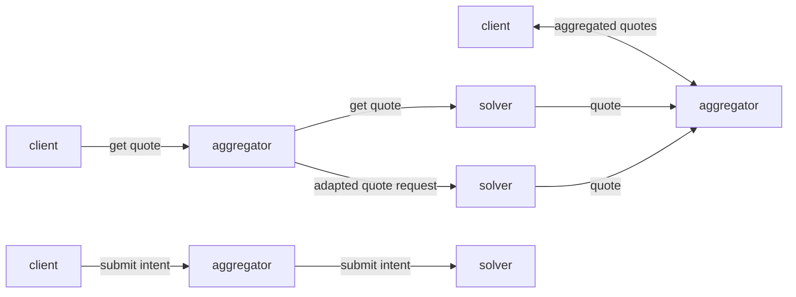

Welcome to the docs! Start with one of the sections below.

### Example: Mermaid diagram

## What is Next?

<Cards>
  <Card title="Smart Contracts" href="/docs/smart-contracts" />
  <Card title="Solvers" href="/docs/solvers" />
  <Card title="Aggregators" href="/docs/aggregators" />
  <Card title="APIs" href="/docs/apis" />
</Cards>
