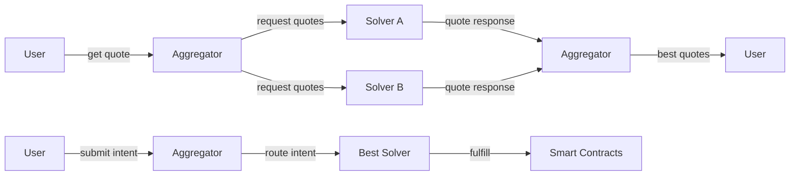
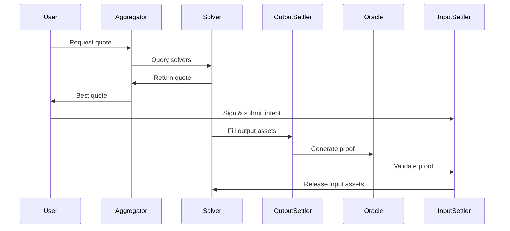

# Open Intents Framework (OIF)

The Open Intents Framework (OIF) is a full-stack developer framework that enables permissionless cross-chain intents to be deployed, solved, and discovered. OIF provides a modular, intent-based protocol for cross-chain swaps where users sign customizable intents describing desired assets, delivery conditions, validation requirements, and execution parameters.

## What Are Intents?

Intents are user-signed descriptions of desired outcomes. Instead of specifying exact transaction steps, users express what they want to achieve (e.g., "swap 100 USDC on Base for ETH on Arbitrum"), and solvers compete to fulfill these intents efficiently.

## Core Components

OIF consists of three main components:

- **Smart Contracts**: On-chain settlement infrastructure for intent execution and validation
- **Solvers**: Off-chain services that discover, price, and fulfill user intents
- **Aggregators**: Services that route intents to multiple solvers for optimal pricing

### How It Works

## Key Features

### Output-Input Separation

OIF is built with output-input separation, fully decoupling system components to support different asset collection mechanisms. Both Output First and Input Second flows are supported through Resource Locks and traditional escrows in a unified system.

### Permissionless Architecture

The framework is designed to be permissionlessly expanded while providing a foundation for more expressive intents that can be composed with OIF deployments.

### Modular Design

The protocol is structured around specialized contracts:
- **InputSettler**: Validates intent fulfillment and releases input assets
- **OutputSettler**: Enables solvers to deliver output assets
- **Oracle**: Proof layer for cross-chain validation (messaging protocols, optimistic proofs, storage proofs, etc.)

## Architecture Overview

## Getting Started

Choose your integration path:

<Cards>
  <Card title="Smart Contracts" href="/docs/smart-contracts" />
  <Card title="Solvers" href="/docs/solvers" />
  <Card title="Aggregators" href="/docs/aggregators" />
  <Card title="Integration Guide" href="/docs/integration" />
</Cards>

## Use Cases

- **Cross-Chain Swaps**: Exchange assets across different blockchain networks
- **Gas Sponsorship**: Execute logic with sponsored gas payments
- **DeFi Composability**: Chain complex operations across multiple chains
- **New L2 Onboarding**: Provide instant liquidity for emerging Layer 2 networks

## Next Steps

- **New to OIF?** Start with the [Smart Contracts Overview](/docs/smart-contracts/overview)
- **Building a Solver?** Check out the [Solver Quickstart](/docs/solvers/quickstart)
- **Integrating OIF?** Read the [Integration Guide](/docs/integration/quickstart)
