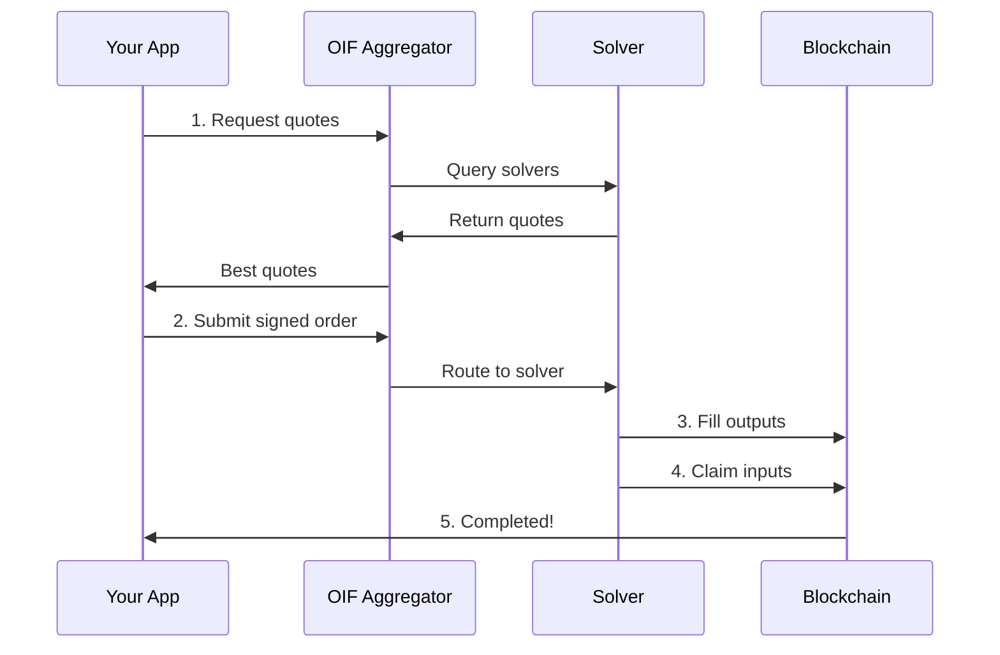

# Integration Guide

Learn how to integrate OIF into your application, whether you're building a wallet, DApp, or protocol.

## Getting Started

Choose your integration path and get started quickly:

<Cards>
  <Card title="Integration Overview" href="/docs/integration/overview" description="Understand integration options and architecture" />
  <Card title="Quickstart" href="/docs/integration/quickstart" description="Execute your first swap in 5 minutes" />
  <Card title="OpenAPI Reference" href="/docs/integration/openapi" description="Interactive API documentation" />
</Cards>

## API Documentation

For detailed API reference, see the dedicated API section:

<Cards>
  <Card title="API Overview" href="/docs/apis" description="Complete REST API reference" />
  <Card title="Quotes API" href="/docs/apis/quote-api" description="Request quotes from solvers" />
  <Card title="Orders API" href="/docs/apis/order-api" description="Submit and track orders" />
  <Card title="Error Handling" href="/docs/apis/errors" description="Error codes and solutions" />
</Cards>

## Component Integration

Integrate with specific OIF components:

<Cards>
  <Card title="Smart Contracts" href="/docs/smart-contracts" description="Deploy and interact with contracts" />
  <Card title="Run a Solver" href="/docs/solvers" description="Operate solver infrastructure" />
  <Card title="Deploy Aggregator" href="/docs/aggregators" description="Run your own aggregator" />
</Cards>

## Integration Paths

### For Wallets & DApps

Integrate OIF APIs to offer cross-chain swaps:

1. **Request quotes** from multiple solvers via aggregator
2. **Present options** to users with best rates
3. **Submit signed intents** for execution
4. **Track status** through completion

**Start here**: [Integration Quickstart](/docs/integration/quickstart)

### For Protocols

Deploy your own infrastructure:

1. **Deploy aggregator** with custom solver selection
2. **Configure authentication** and rate limits
3. **Monitor performance** and solver health
4. **Scale** with load balancing

**Start here**: [Aggregator Quickstart](/docs/aggregators/quickstart)

### For Solvers

Earn fees by fulfilling intents:

1. **Deploy solver** infrastructure
2. **Monitor intent** events across chains
3. **Fill outputs** and claim inputs
4. **Optimize** execution strategies

**Start here**: [Solver Quickstart](/docs/solvers/quickstart)

## Key Concepts

### EIP-7930 Cross-Chain Addresses

OIF uses a special address format that embeds chain information:

```
0x0001 + chainId (4 bytes) + address (20 bytes)
```

**Example**: `0x00010000010114D8DA6BF26964AF9D7EED9E03E53415D37AA96045`

See [Integration Overview](/docs/integration/overview#eip-7930-cross-chain-addresses) for details.

### Swap Flow



### Standards

OIF implements:

- **EIP-7930**: Cross-chain address format
- **EIP-7683**: Cross-chain intent standard
- **The Compact**: Gas-efficient resource locks
- **ERC-7930**: Open Intent Framework API

## Code Examples

### TypeScript

```typescript
import { OIFClient } from '@oif/client'; // Coming soon

const client = new OIFClient('http://localhost:3000');

// Get quotes
const quotes = await client.getQuotes({
  user: '0x00010000010114D8DA6BF26964AF9D7EED9E03E53415D37AA96045',
  intent: {
    intentType: 'oif-swap',
    inputs: [{ /* ... */ }],
    outputs: [{ /* ... */ }]
  }
});

// Submit order
const order = await client.submitOrder(
  quotes[0].quoteId,
  signature,
  userAddress
);
```

See [Complete Examples](/docs/apis/examples) for production code.

### Python

```python
import requests

response = requests.post(
    'http://localhost:3000/v1/quotes',
    json={
        'user': '0x00010000010114D8DA6BF26964AF9D7EED9E03E53415D37AA96045',
        'intent': { ... }
    }
)
quotes = response.json()
```

See [Complete Examples](/docs/apis/examples) for production code.

## Production Checklist

Before going to production:

- [ ] Test thoroughly on testnets
- [ ] Implement proper error handling
- [ ] Add retry logic with exponential backoff
- [ ] Verify quote integrity checksums
- [ ] Set up monitoring and alerting
- [ ] Review security best practices
- [ ] Test edge cases (expiration, failures)
- [ ] Load test your integration

## Support

- **Documentation**: Browse this integration guide and [API docs](/docs/apis)
- **Examples**: See [complete code examples](/docs/apis/examples)
- **Issues**: [GitHub Issues](https://github.com/openintentsframework/oif-aggregator/issues)
- **OpenAPI**: Interactive playground at [/docs/integration/openapi](/docs/integration/openapi)

## Next Steps

<Cards>
  <Card title="Start Building" href="/docs/integration/quickstart" description="Get your first swap working in 5 minutes" />
  <Card title="Read the Docs" href="/docs/apis" description="Comprehensive API reference" />
  <Card title="See Examples" href="/docs/apis/examples" description="Production-ready code samples" />
</Cards>

