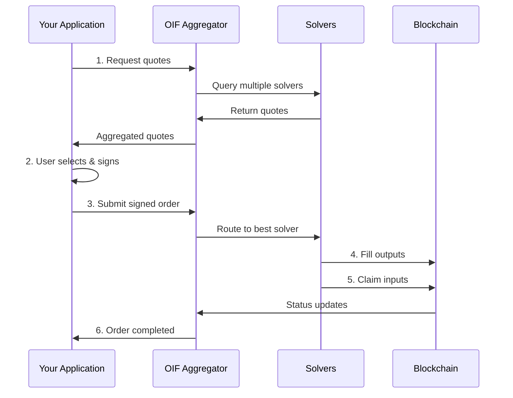

# Integration Overview

The Open Intents Framework provides multiple integration paths depending on your use case. This guide helps you choose the right approach and get started quickly.

## Integration Options

### 1. API Integration (Most Common)

Integrate directly with the OIF Aggregator API to access multiple solvers.

**Best For**:
- Wallets wanting to offer cross-chain swaps
- DApps needing intent-based transactions
- Frontends requiring quote aggregation

**Key Features**:
- Access to multiple solvers via single API
- Automatic quote aggregation and selection
- No infrastructure to maintain

**Get Started**: [API Documentation](/docs/apis)

### 2. Run Your Own Solver

Deploy solver infrastructure to fulfill intents and earn fees.

**Best For**:
- Liquidity providers
- Market makers
- Protocol teams with execution capabilities

**Key Features**:
- Earn fees from fulfilled intents
- Control execution strategy
- Direct access to order flow

**Get Started**: [Solver Documentation](/docs/solvers)

### 3. Deploy Aggregator Instance

Run your own aggregator instance for complete control.

**Best For**:
- Protocols needing custom solver selection
- Teams requiring private deployment
- High-volume integrations needing custom configuration

**Key Features**:
- Full control over solver set
- Custom rate limits and authentication
- Private deployment

**Get Started**: [Aggregator Documentation](/docs/aggregators)

## Integration Flow



## Quick Start Guide

### Step 1: Choose Your Path

**For Wallets/DApps**: Start with [API Integration](/docs/integration/quickstart)  
**For Solvers**: Start with [Solver Quickstart](/docs/solvers/quickstart)  
**For Protocols**: Start with [Aggregator Setup](/docs/aggregators/quickstart)

### Step 2: Understand Core Concepts

Before integrating, familiarize yourself with:

- **EIP-7930 Addresses**: Cross-chain address format
- **Swap Types**: exact-input vs exact-output
- **Lock Mechanisms**: The Compact, escrow, etc.
- **Quote Lifecycle**: Request → Sign → Submit → Execute

See [API Overview](/docs/apis) for detailed explanations.

### Step 3: Get Your Environment Ready

#### Local Development

```bash
# Run local aggregator
cd oif-aggregator
export INTEGRITY_SECRET="dev-secret-min-32-chars"
cargo run

# In another terminal, test it
curl http://localhost:3000/health
```

#### Testnet Integration

1. Deploy or use existing testnet contracts
2. Configure solver for testnets (Sepolia, Arbitrum Sepolia, etc.)
3. Fund accounts with testnet tokens
4. Test complete flows end-to-end

### Step 4: Implement Integration

Follow language-specific guides:
- [TypeScript/JavaScript](/docs/integration/examples#typescript)
- [Python](/docs/integration/examples#python)
- [Rust](/docs/integration/examples#rust)

### Step 5: Test Thoroughly

Use the [testing guide](/docs/integration/testing) to verify:
- Quote requests work correctly
- Order submission succeeds
- Status polling functions properly
- Error handling is robust

### Step 6: Go to Production

Follow the [production checklist](/docs/integration/production) before launching.

## Architecture Patterns

### Pattern 1: Direct API Integration

```typescript
// Your app talks directly to aggregator
App → OIF Aggregator API → Solvers
```

**Pros**: Simplest integration, no infrastructure  
**Cons**: Dependent on aggregator availability

### Pattern 2: SDK Integration (Coming Soon)

```typescript
import { OIFClient } from '@oif/sdk';
const client = new OIFClient({ baseUrl: '...' });
```

**Pros**: Type-safe, handles errors, retries  
**Cons**: Limited to SDK-supported languages

### Pattern 3: Custom Aggregator

```typescript
// Run your own aggregator instance
Your App → Your Aggregator → Your Solver Set
```

**Pros**: Full control, custom logic  
**Cons**: Infrastructure overhead

## Key Concepts

### EIP-7930 Cross-Chain Addresses

OIF uses a special address format that embeds chain information:

```
0x0001 + chainId (4 bytes) + address (20 bytes)
```

**Example** (Ethereum mainnet):
```
0x00010000010114D8DA6BF26964AF9D7EED9E03E53415D37AA96045
  │    │      │  └─ Address (20 bytes)
  │    │      └─ Chain ID: 1 (4 bytes)
  │    └─ Reserved
  └─ Version: 1
```

This format eliminates ambiguity in cross-chain operations.

### Swap Types

**Exact Input**: User specifies exact input amount, quotes output amount
```json
{
  "swapType": "exact-input",
  "inputs": [{ "amount": "1000000000" }],  // Fixed
  "outputs": [{ }]  // To be quoted
}
```

**Exact Output**: User specifies exact output amount, quotes input needed
```json
{
  "swapType": "exact-output",
  "inputs": [{ }],  // To be quoted
  "outputs": [{ "amount": "1000000000000000000" }]  // Fixed
}
```

### Lock Mechanisms

Assets are locked during cross-chain transfer using:

- **The Compact**: Gas-efficient resource locks
- **Escrow**: Traditional lock-and-release
- **Custom**: Protocol-specific mechanisms

```json
{
  "lock": {
    "kind": "the-compact",
    "params": {}
  }
}
```

## Security Considerations

### 1. Quote Integrity

Always verify HMAC checksums to detect tampering:

```typescript
function verifyIntegrity(quote, secret) {
  const checksum = hmac_sha256(quote.data, secret);
  return checksum === quote.integrity.checksum;
}
```

### 2. Quote Expiration

Check expiration before submission:

```typescript
const now = Math.floor(Date.now() / 1000);
if (quote.expiresAt < now + 10) { // 10s buffer
  // Quote expired or expiring soon
  requestNewQuotes();
}
```

### 3. Signature Security

- Never sign untrusted data
- Verify quote contents match expectations
- Use hardware wallets for production

### 4. Amount Validation

Always validate amounts are as expected:

```typescript
const expectedOutput = calculateExpectedOutput(input);
if (quote.outputs[0].amount < expectedOutput * 0.99) {
  // Output less than 99% of expected
  throw new Error('Unexpected slippage');
}
```

## Common Integration Patterns

### Pattern: Quote Comparison UI

```typescript
async function displayQuotes(request) {
  const response = await getQuotes(request);
  
  // Sort by best output amount
  const sorted = response.quotes.sort((a, b) => {
    const aOutput = BigInt(a.outputs[0].amount);
    const bOutput = BigInt(b.outputs[0].amount);
    return bOutput > aOutput ? 1 : -1;
  });
  
  // Display to user
  sorted.forEach(quote => {
    displayQuoteCard({
      solver: quote.solverId,
      output: formatAmount(quote.outputs[0].amount),
      estimatedTime: quote.estimatedFillTime,
      selected: false
    });
  });
}
```

### Pattern: Auto-Refresh Quotes

```typescript
class QuoteManager {
  private quotes = [];
  private refreshInterval = 30000; // 30 seconds

  async startAutoRefresh(request) {
    await this.refreshQuotes(request);
    
    setInterval(async () => {
      await this.refreshQuotes(request);
    }, this.refreshInterval);
  }

  private async refreshQuotes(request) {
    try {
      const response = await getQuotes(request);
      this.quotes = response.quotes;
      this.onQuotesUpdated(this.quotes);
    } catch (error) {
      console.error('Failed to refresh quotes:', error);
    }
  }
}
```

### Pattern: Progressive Status Updates

```typescript
async function trackOrder(orderId, onUpdate) {
  const statusMessages = {
    pending: 'Order submitted, waiting for solver...',
    filling: 'Solver is delivering your assets...',
    filled: 'Assets delivered, claiming inputs...',
    claiming: 'Finalizing transaction...',
    completed: 'Swap completed successfully!'
  };

  while (true) {
    const order = await getOrder(orderId);
    onUpdate(statusMessages[order.status], order);

    if (['completed', 'failed', 'expired'].includes(order.status)) {
      break;
    }

    await sleep(5000);
  }
}
```

## Error Handling Strategy

```typescript
async function robustSwap(request, maxRetries = 3) {
  for (let attempt = 0; attempt < maxRetries; attempt++) {
    try {
      // Get fresh quotes
      const quotes = await getQuotes(request);
      
      // Select and submit
      const order = await submitBestQuote(quotes[0]);
      
      // Wait for completion
      return await waitForCompletion(order.orderId);
      
    } catch (error) {
      console.error(`Attempt ${attempt + 1} failed:`, error);
      
      if (attempt === maxRetries - 1) throw error;
      
      // Exponential backoff
      await sleep(1000 * Math.pow(2, attempt));
    }
  }
}
```

## Next Steps

<Cards>
  <Card title="Quickstart" href="/docs/integration/quickstart" description="Get started with your first integration" />
  <Card title="API Reference" href="/docs/apis" description="Complete API documentation" />
  <Card title="Examples" href="/docs/apis/examples" description="Code examples in multiple languages" />
  <Card title="Testing" href="/docs/integration/testing" description="Test your integration thoroughly" />
</Cards>

## Support

- **Documentation**: Browse this integration guide
- **API Playground**: Test at `/swagger-ui` when running with OpenAPI
- **Examples**: See complete code in [Examples](/docs/apis/examples)
- **Issues**: [GitHub Issues](https://github.com/openintentsframework/oif-aggregator/issues)

