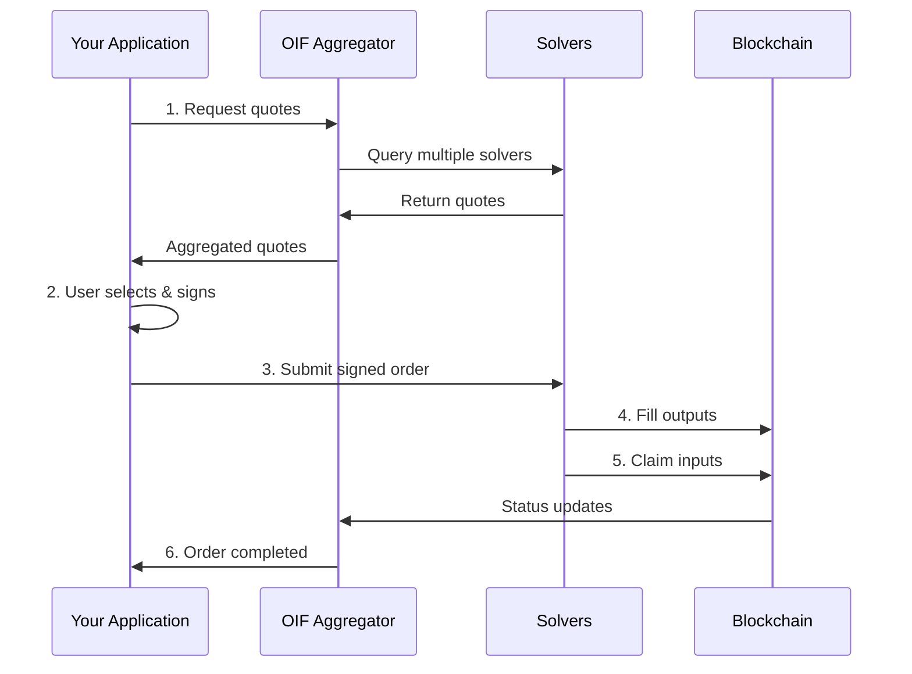

# Integration Overview & Quickstart

Get started with OIF integration in under 5 minutes, then dive deeper into integration patterns and best practices.


## 🏗️ Integration Flow

This is an example integration flow using the OIF Aggregator, but it can be skipped and interact directly with a preferred solver.



---
## 🚀 Quickstart: Your First Swap

### Prerequisites

- **Node.js 18+** or **Python 3.8+**
- **Local aggregator running** OR access to a deployed instance
- **Basic blockchain knowledge** (addresses, signing)

<Callout type="info">
This quickstart uses simplified examples. For production code, see [Complete Examples](/docs/apis/examples).
</Callout>

### Step 1: Start Local Aggregator (Optional)

If you don't have access to a deployed aggregator, run one locally:

```bash
# Clone and run aggregator
git clone https://github.com/openintentsframework/oif-aggregator.git
cd oif-aggregator
export INTEGRITY_SECRET="quickstart-secret-min-32-characters"
cargo run
```

Wait for the server to start on `http://localhost:3000`.

Verify it's running:
```bash
curl http://localhost:3000/health
```

### Step 2: Request Quotes

#### Using cURL

```bash
curl -X POST http://localhost:3000/v1/quotes \
  -H "Content-Type: application/json" \
  -d '{
    "user": "0x00010000010114D8DA6BF26964AF9D7EED9E03E53415D37AA96045",
    "intent": {
      "intentType": "oif-swap",
      "inputs": [{
        "user": "0x00010000010114D8DA6BF26964AF9D7EED9E03E53415D37AA96045",
        "asset": "0x000100000101A0b86991c6218b36c1d19D4a2e9Eb0cE3606eB48",
        "amount": "1000000000",
        "lock": {"kind": "the-compact"}
      }],
      "outputs": [{
        "receiver": "0x00010000010114D8DA6BF26964AF9D7EED9E03E53415D37AA96045",
        "asset": "0x000100000101C02aaA39b223FE8D0A0e5C4F27eAD9083C756Cc2"
      }]
    },
    "swapType": "exact-input"
  }'
```

#### Using JavaScript/TypeScript

```javascript
const BASE_URL = 'http://localhost:3000';

async function getQuotes() {
  const response = await fetch(`${BASE_URL}/v1/quotes`, {
    method: 'POST',
    headers: { 'Content-Type': 'application/json' },
    body: JSON.stringify({
      user: '0x00010000010114D8DA6BF26964AF9D7EED9E03E53415D37AA96045',
      intent: {
        intentType: 'oif-swap',
        inputs: [{
          user: '0x00010000010114D8DA6BF26964AF9D7EED9E03E53415D37AA96045',
          asset: '0x000100000101A0b86991c6218b36c1d19D4a2e9Eb0cE3606eB48',
          amount: '1000000000',
          lock: { kind: 'the-compact' }
        }],
        outputs: [{
          receiver: '0x00010000010114D8DA6BF26964AF9D7EED9E03E53415D37AA96045',
          asset: '0x000100000101C02aaA39b223FE8D0A0e5C4F27eAD9083C756Cc2'
        }]
      },
      swapType: 'exact-input'
    })
  });

  return await response.json();
}
```

#### Using Python

```python
import requests

def get_quotes():
    response = requests.post(
        'http://localhost:3000/v1/quotes',
        json={
            'user': '0x00010000010114D8DA6BF26964AF9D7EED9E03E53415D37AA96045',
            'intent': {
                'intentType': 'oif-swap',
                'inputs': [{
                    'user': '0x00010000010114D8DA6BF26964AF9D7EED9E03E53415D37AA96045',
                    'asset': '0x000100000101A0b86991c6218b36c1d19D4a2e9Eb0cE3606eB48',
                    'amount': '1000000000',
                    'lock': {'kind': 'the-compact'}
                }],
                'outputs': [{
                    'receiver': '0x00010000010114D8DA6BF26964AF9D7EED9E03E53415D37AA96045',
                    'asset': '0x000100000101C02aaA39b223FE8D0A0e5C4F27eAD9083C756Cc2'
                }]
            },
            'swapType': 'exact-input'
        }
    )
    return response.json()
```

### Step 3: Understanding the Response

You should see a response like:

```json
{
  "quotes": [{
    "quoteId": "quote_abc123xyz",
    "solverId": "solver-1",
    "outputs": [{
      "amount": "400000000000000000"
    }],
    "expiresAt": 1703123756,
    "estimatedFillTime": 30
  }],
  "totalQuotes": 1
}
```

**Key fields**:
- `quoteId`: Use this to submit the order
- `outputs[0].amount`: How much you'll receive (0.4 ETH in this example)
- `expiresAt`: Quote expiration timestamp
- `estimatedFillTime`: Expected execution time in seconds

### Step 4: Submit Order (Production Flow)

<Callout type="warn">
**Note**: Order submission requires signing with a real private key. See [Complete Examples](/docs/apis/examples) for production signing code.
</Callout>

The full flow:

```javascript
// 1. Get quotes
const quotes = await getQuotes();
const bestQuote = quotes.quotes[0];

// 2. Sign the quote (requires wallet)
// const signature = await wallet.signMessage(bestQuote.quoteId);

// 3. Submit order
const order = await fetch(`${BASE_URL}/v1/orders`, {
  method: 'POST',
  headers: { 'Content-Type': 'application/json' },
  body: JSON.stringify({
    quoteId: bestQuote.quoteId,
    signature: '0x...', // Your signature
    userAddress: '0x...'
  })
});

// 4. Poll for status
const checkStatus = async (orderId) => {
  const status = await fetch(`${BASE_URL}/v1/orders/${orderId}`);
  return await status.json();
};
```

---

## 📋 Integration Options

Choose the integration path that fits your use case:

### 1. API Integration (Most Common)

Integrate directly with the OIF Aggregator API to access multiple solvers.

**Best For**:
- Wallets wanting to offer cross-chain swaps
- DApps needing intent-based transactions
- Frontends requiring quote aggregation

**Key Features**:
- Access to multiple solvers via single API
- Automatic quote aggregation and selection
- No infrastructure to maintain

**Get Started**: [API Documentation](/docs/apis)

### 2. Run Your Own Solver

Deploy solver infrastructure to fulfill intents and earn fees.

**Best For**:
- Liquidity providers
- Market makers
- Protocol teams with execution capabilities

**Key Features**:
- Earn fees from fulfilled intents
- Control execution strategy
- Direct access to order flow

**Get Started**: [Solver Documentation](/docs/solvers)

### 3. Deploy Aggregator Instance

Run your own aggregator instance for complete control.

**Best For**:
- Protocols needing custom solver selection
- Teams requiring private deployment
- High-volume integrations needing custom configuration

**Key Features**:
- Full control over solver set
- Custom rate limits and authentication
- Private deployment

**Get Started**: [Aggregator Documentation](/docs/aggregators)

---


## 🔑 Key Concepts

### EIP-7930 Cross-Chain Addresses

OIF uses a special address format that embeds chain information:

```
0x0001 + chainId (4 bytes) + address (20 bytes)
```

**Example** (Ethereum mainnet):
```
0x00010000010114D8DA6BF26964AF9D7EED9E03E53415D37AA96045
  │    │      │  └─ Address (20 bytes)
  │    │      └─ Chain ID: 1 (4 bytes)
  │    └─ Reserved
  └─ Version: 1
```

**Converting regular address to EIP-7930**:

```javascript
function toEIP7930(address, chainId) {
  const addr = address.slice(2);
  const chain = chainId.toString(16).padStart(8, '0');
  return `0x0001${chain}${addr}`;
}

// Example
const eip7930 = toEIP7930('0x14D8DA6BF2696...', 1);
```

**Common chain IDs**:
- Ethereum: `1` → `0x00010000010`
- Arbitrum: `42161` → `0x00010000A4B1`
- Optimism: `10` → `0x0001000000A`
- Base: `8453` → `0x000100000021`

### Swap Types

**Exact Input**: User specifies exact input amount, quotes output amount

```json
{
  "swapType": "exact-input",
  "inputs": [{ "amount": "1000000000" }],
  "outputs": [{ }]
}
```

**Exact Output**: User specifies exact output amount, quotes input needed

```json
{
  "swapType": "exact-output",
  "inputs": [{ }],
  "outputs": [{ "amount": "1000000000000000000" }]
}
```

### Lock Mechanisms

Assets are locked during cross-chain transfer using:

- **The Compact**: Gas-efficient resource locks
- **Escrow**: Traditional lock-and-release
- **Custom**: Protocol-specific mechanisms

```json
{
  "lock": {
    "kind": "the-compact",
    "params": {}
  }
}
```

---

## 🛡️ Security Considerations

### 1. Quote Integrity

Always verify HMAC checksums to detect tampering:

```typescript
function verifyIntegrity(quote, secret) {
  const checksum = hmac_sha256(quote.data, secret);
  return checksum === quote.integrity.checksum;
}
```

### 2. Quote Expiration

Check expiration before submission:

```typescript
const now = Math.floor(Date.now() / 1000);
if (quote.expiresAt < now + 10) {
  requestNewQuotes();
}
```

### 3. Signature Security

- Never sign untrusted data
- Verify quote contents match expectations
- Use hardware wallets for production

### 4. Amount Validation

Always validate amounts are as expected:

```typescript
const expectedOutput = calculateExpectedOutput(input);
if (quote.outputs[0].amount < expectedOutput * 0.99) {
  throw new Error('Unexpected slippage');
}
```

---

## 📐 Architecture Patterns

### Pattern 1: Direct API Integration

```
App → OIF Aggregator API → Solvers
```

**Pros**: Simplest integration, no infrastructure  
**Cons**: Dependent on aggregator availability

### Pattern 2: SDK Integration (Coming Soon)

```typescript
import { OIFClient } from '@oif/sdk';
const client = new OIFClient({ baseUrl: '...' });
```

**Pros**: Type-safe, handles errors, retries  
**Cons**: Limited to SDK-supported languages

### Pattern 3: Custom Aggregator

```
Your App → Your Aggregator → Your Solver Set
```

**Pros**: Full control, custom logic  
**Cons**: Infrastructure overhead

---

## 💻 Common Integration Patterns

### Pattern: Quote Comparison UI

```typescript
async function displayQuotes(request) {
  const response = await getQuotes(request);
  
  const sorted = response.quotes.sort((a, b) => {
    const aOutput = BigInt(a.outputs[0].amount);
    const bOutput = BigInt(b.outputs[0].amount);
    return bOutput > aOutput ? 1 : -1;
  });
  
  sorted.forEach(quote => {
    displayQuoteCard({
      solver: quote.solverId,
      output: formatAmount(quote.outputs[0].amount),
      estimatedTime: quote.estimatedFillTime
    });
  });
}
```

### Pattern: Auto-Refresh Quotes

```typescript
class QuoteManager {
  async startAutoRefresh(request) {
    await this.refreshQuotes(request);
    
    setInterval(async () => {
      await this.refreshQuotes(request);
    }, 30000); // 30 seconds
  }
}
```

### Pattern: Progressive Status Updates

```typescript
async function trackOrder(orderId, onUpdate) {
  const statusMessages = {
    pending: 'Order submitted, waiting for solver...',
    filling: 'Solver is delivering your assets...',
    filled: 'Assets delivered, claiming inputs...',
    completed: 'Swap completed successfully!'
  };

  while (true) {
    const order = await getOrder(orderId);
    onUpdate(statusMessages[order.status], order);

    if (['completed', 'failed', 'expired'].includes(order.status)) {
      break;
    }

    await sleep(5000);
  }
}
```

---

## 🐛 Troubleshooting

### Error: "No quotes available"

**Cause**: No solvers configured or all solvers failed

**Solution**:
```bash
curl http://localhost:3000/v1/solvers | jq
curl http://localhost:3000/health | jq
```

### Error: "Connection refused"

**Cause**: Aggregator not running

**Solution**:
```bash
cd oif-aggregator
export INTEGRITY_SECRET="your-secret-min-32-chars"
cargo run
```

### Error: "VALIDATION_ERROR"

**Cause**: Invalid request format

**Solution**:
- Verify addresses are in EIP-7930 format
- Ensure amounts are strings, not numbers
- Check all required fields are present

---

## ✅ Production Checklist

Before going to production:

- [ ] Implement proper error handling
- [ ] Add retry logic with exponential backoff
- [ ] Verify quote integrity checksums
- [ ] Check quote expiration before submission
- [ ] Implement proper signature generation
- [ ] Test on testnets thoroughly
- [ ] Set up monitoring and alerting
- [ ] Review security best practices
- [ ] Load test your integration
- [ ] Validate all user inputs

---

## 🔗 Quick Reference

### API Endpoints

| Endpoint | Method | Purpose |
|----------|--------|---------|
| `/health` | GET | Check aggregator health |
| `/v1/quotes` | POST | Request quotes from solvers |
| `/v1/orders` | POST | Submit signed order |
| `/v1/orders/:id` | GET | Check order status |
| `/v1/solvers` | GET | List available solvers |

See [API Reference](/docs/apis) for detailed documentation.

---

## 📚 Next Steps

### Complete Examples

<Cards>
  <Card title="API Reference" href="/docs/apis" description="Complete API documentation" />
  <Card title="Code Examples" href="/docs/apis/examples" description="Production-ready code in TypeScript, Python, Rust" />
  <Card title="Error Handling" href="/docs/apis/errors" description="Handle errors properly" />
  <Card title="Authentication" href="/docs/apis/authentication" description="API keys and HMAC verification" />
</Cards>

### Deploy Your Own

<Cards>
  <Card title="Run a Solver" href="/docs/solvers" description="Earn fees by fulfilling intents" />
  <Card title="Deploy Aggregator" href="/docs/aggregators" description="Run your own aggregator instance" />
  <Card title="Smart Contracts" href="/docs/smart-contracts" description="Understand the on-chain layer" />
</Cards>

---

## 🤝 Support

- **Documentation**: You're reading it!
- **API Playground**: Test at `/swagger-ui` when running with OpenAPI
- **Examples**: See [Complete Examples](/docs/apis/examples)
- **Issues**: [GitHub Issues](https://github.com/openintentsframework/oif-aggregator/issues)
