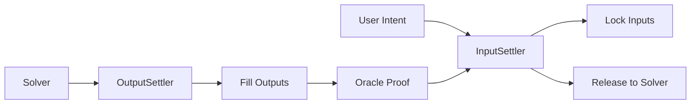

# Smart Contracts

Welcome to the OIF Smart Contracts documentation. This section covers the on-chain infrastructure that powers permissionless cross-chain intent execution.

<Callout type="warn">
**Security Warning**: This project currently uses an unaudited version of OpenZeppelin Contracts. Before any production release, it is mandatory to update to the latest audited version.
</Callout>

## What Are OIF Smart Contracts?

OIF smart contracts provide the settlement layer for cross-chain intents. They handle:
- **Intent Submission**: Users submit signed intents describing desired outcomes
- **Output Delivery**: Solvers fulfill outputs on destination chains
- **Proof Validation**: Oracle systems verify cross-chain fulfillment
- **Input Settlement**: Users' input assets are released to solvers upon validation

## Key Components

### InputSettler
Deployed on the input (source) chain, manages:
- Locking user input assets
- Validating oracle proofs of output delivery
- Releasing assets to successful solvers

**Implementations:**
- `InputSettlerCompact`: Gas-efficient using Resource Locks
- `InputSettlerEscrow`: Traditional escrow-based settlement

### OutputSettler
Deployed on the output (destination) chain, handles:
- Accepting solver fills
- Generating attestations for oracle systems
- Validating payload integrity

### Oracle
Proof layer connecting input and output chains:
- Cross-chain messaging protocols
- Optimistic proof systems
- Storage proofs or light clients

## Architecture Highlights



### Output-Input Separation

OIF fully separates input and output handling, enabling:
- **Multiple Settlement Patterns**: Escrow, Resource Locks, custom implementations
- **Flexible Oracle Systems**: Any messaging protocol or proof system
- **Bi-directional Support**: Swaps in either direction, even with asymmetric chain capabilities

## Features

### Permissionless
- No whitelisting of solvers
- Open deployment of new Settler implementations
- Composable with existing OIF infrastructure

### Multi-Chain Native
- Support for any EVM-compatible chain
- Directional proofs for asymmetric chain support

### Modular & Extensible
- Implement custom Settlers compatible with existing solvers
- Integrate any oracle or messaging protocol
- Support for multiple order types and lock mechanisms

## Getting Started

<Cards>
  <Card title="Overview" href="/docs/smart-contracts/overview" description="Learn about architecture, key concepts, and security considerations" />
  <Card title="Quickstart" href="/docs/smart-contracts/quickstart" description="Deploy contracts locally and test intent flows" />
  <Card title="Core Contracts" href="/docs/smart-contracts/core-contracts" description="Deep dive into InputSettler, OutputSettler, and Oracle implementations" />
  <Card title="Deployment" href="/docs/smart-contracts/deployment" description="Production deployment guides and best practices" />
</Cards>

## Use Cases

- **Cross-Chain DEX**: Enable swaps across any blockchain networks
- **Intent-Based Protocols**: Build expressive intent systems
- **L2 Bridging**: Provide instant cross-chain liquidity
- **DeFi Composability**: Chain operations across multiple chains

## Security Considerations

Key security aspects to understand:
- **First Solver Ownership**: First output filler owns the order
- **Multi-Output Risks**: DoS and price manipulation vectors
- **Callback Safety**: Arbitrary code execution during fills
- **Underwriting**: Capital rotation and risk management

See [Overview - Security Considerations](/docs/smart-contracts/overview#security-considerations) for details.

## Development Tools

OIF contracts are built with:
- **Foundry**: Fast, portable Ethereum development toolkit
- **OpenZeppelin**: Security-focused contract libraries
- **Forge**: Testing and deployment framework

## Repository Structure

```
oif-contracts/
├── src/
│   ├── input/          # InputSettler implementations
│   ├── output/         # OutputSettler implementations
│   ├── oracles/        # Oracle implementations
│   ├── interfaces/     # Contract interfaces
│   └── libs/           # Shared libraries
├── test/               # Comprehensive test suite
├── script/             # Deployment scripts
└── lib/                # Dependencies
```

## Contributing

OIF is open for contributions! See the [CONTRIBUTING.md](https://github.com/openintentsframework/oif-contracts/blob/main/CONTRIBUTING.md) guide.

## Next Steps

1. **New to OIF?** Start with [Overview](/docs/smart-contracts/overview) to understand the architecture
2. **Ready to build?** Follow the [Quickstart](/docs/smart-contracts/quickstart) guide
3. **Deploying?** Check [Deployment](/docs/smart-contracts/deployment) for production guidance

## Additional Resources

- [GitHub Repository](https://github.com/openintentsframework/oif-contracts)
- [API Specification Repository](https://github.com/openintentsframework/oif-specifications)
- [Solver Documentation](/docs/solvers)
- [Aggregator Documentation](/docs/aggregators)

