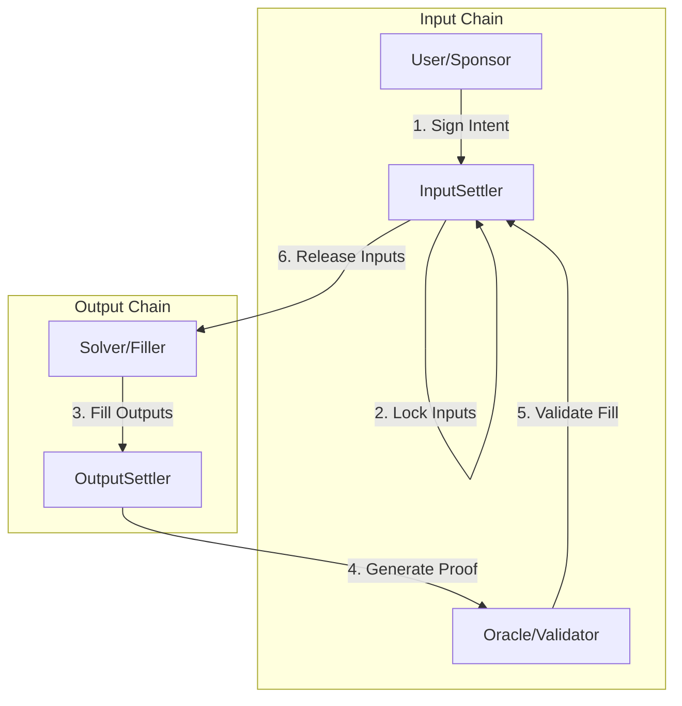

# Smart Contracts Overview

The OIF smart contracts provide the on-chain infrastructure for permissionless cross-chain intent execution. The system is built with output-input separation, fully decoupling components to support different asset collection mechanisms.

<Callout type="warn">
**Security Warning**: This project currently uses an unaudited version of OpenZeppelin Contracts. Before any production release, it is mandatory to update to the latest audited version.
</Callout>

## Core Architecture

OIF implements a modular architecture with three primary contract types:



### InputSettler

Located on the input chain, the InputSettler contract handles:
- **Intent Validation**: Verifies that outputs were delivered using oracle proofs
- **Input Management**: Locks and releases input assets
- **Settlement Finalization**: Completes intents after validation

**Current Implementations:**
- `InputSettlerCompact`: Uses Resource Locks (Compact) for gas-efficient settlement
- `InputSettlerEscrow`: Traditional escrow-based settlement

### OutputSettler

Located on the output chain, the OutputSettler contract:
- **Accepts Fills**: Allows solvers to deliver output assets
- **Generates Attestations**: Creates proofs of fulfilled outputs
- **Validates Payloads**: Implements `IPayloadValidator` interface

### Oracle

The proof layer connecting input and output chains:
- **Proof Generation**: Creates verifiable evidence of output delivery
- **Cross-Chain Messaging**: Can be any messaging protocol, optimistic proof system, light client, or storage proof mechanism
- **Validation**: Provides `hasAttested()` interface for settlement verification

## Key Concepts

### Intents vs Orders

**Intent**: A user-signed description of a desired state change (typically an asset swap). Contains:
- Input assets (to be paid by sponsor after outputs delivered)
- Output assets (to be delivered by filler)
- Validation requirements
- Execution conditions
- Expiry timestamps

**Order**: The on-chain representation of an intent after submission.

### Roles & Participants

- **User**: End user who creates intents (typically the sponsor)
- **Sponsor**: Provider of input assets on the input chain; receives outputs first, pays inputs second
- **Solver**: External entity that facilitates swaps (typically the filler)
- **Filler**: Provider of output assets; pays outputs first, collects inputs second

### Locks

A lock is an escrow mechanism that provides system participants a claim to assets if specific actions are performed. Locks can be:
- Simple escrow implementations
- Resource Locks (gas-efficient via ERC-7683 Compact)
- Custom implementations

### Multi-Output Orders

When an order contains multiple outputs:
- The **first solver** (filling the first output) becomes the order owner
- Only the first solver can claim inputs after settlement
- Other solvers may fill remaining outputs but won't receive input assets directly

<Callout type="info">
**Best Practice**: Always make the first output the most valuable to incentivize complete order fulfillment.
</Callout>

## Security Considerations

### First Solver Ownership

The solver filling the first output owns the order, creating specific risks:

**For Users:**
- **DoS Risk**: First solver may refuse remaining outputs, delaying execution until expiry
  - *Mitigation*: Make first output most valuable
- **Price Manipulation**: First solver can delay fills, potentially worsening prices
  - *Mitigation*: Avoid time-based mechanisms (Dutch auctions) on non-first outputs

**For Solvers:**
- **Completion Risk**: Must fill ALL outputs before `fillDeadline` and prove completion before `expiry`
- **Callback Risk**: Arbitrary code execution during fills may revert transactions
  - *Mitigation*: Refuse orders with callbacks outside primary batch unless verified safe

### Order Purchasing / Underwriting

OIF supports underwriting (order purchasing) for two purposes:
1. Speed up solver capital rotation by borrowing from less risk-averse solvers
2. Provide expedited UX when users act as solvers

Implement via `InputSettlerPurchase` contract inheritance.

## Supporting Any Chain

### Directional Swaps

OIF only sends directional proofs - oracles only validate outputs. This means:
- Output chain must support proof generation
- Input chain only needs validation logic
- Enables support for chains without full messaging protocol support

## Inputs vs Outputs

**Inputs**: Assets the sponsor offers (on input chain)
**Outputs**: Assets the filler must provide (on output chain)

Key properties:
- InputSettler always sits on input chain with input tokens
- Input is never proven and assumed to exist
- Outputs must be proven via oracle before input release

## Chain IDs

Chain IDs should follow canonical `block.chainid`. While output chainId is defined by the inputOracle, best practice is implementing it as the remote chain's `block.chainid` or equivalent.

## Contract Interfaces

### IPayloadValidator

Output Settlers must expose:
```solidity
function hasAttested(bytes32 payload) external view returns (bool);
```

This validates whether outputs have been filled.

### IInputOracle

Oracle implementations must provide attestation validation for Input Settlers.

### MandateOutput

For compatibility with `MandateOutput` OutputSettlers, implement types from `MandateOutputType.sol` using encoding from `MandateOutputEncodingLib.sol`.

## Extensibility

### Creating New Settlers

To implement a new lock or order type compatible with the system:

1. **OutputSettler Compatibility**: Implement `MandateOutput` structure
2. **Oracle Compatibility**: Implement validation using `IInputOracle` functions
3. **Purchase Support** (optional): Inherit `InputSettlerPurchase` for underwriting

Once implemented, your Settler is compatible with existing solvers and fillers.

## Next Steps

- [Quickstart Guide](/docs/smart-contracts/quickstart): Deploy contracts locally
- [Core Contracts](/docs/smart-contracts/core-contracts): Deep dive into implementations
- [Deployment Guide](/docs/smart-contracts/deployment): Production deployment

