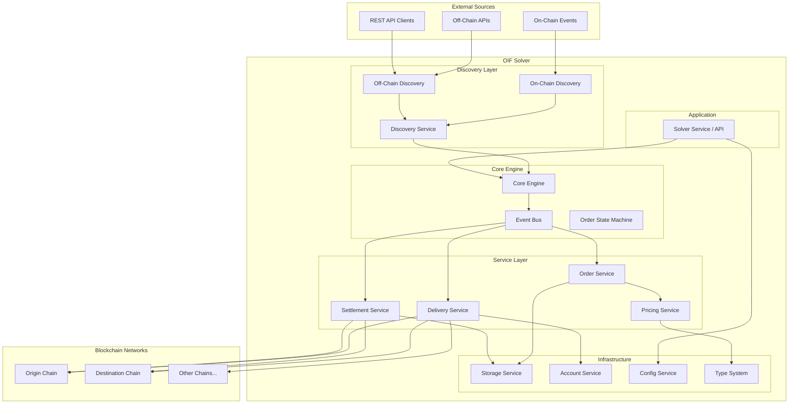
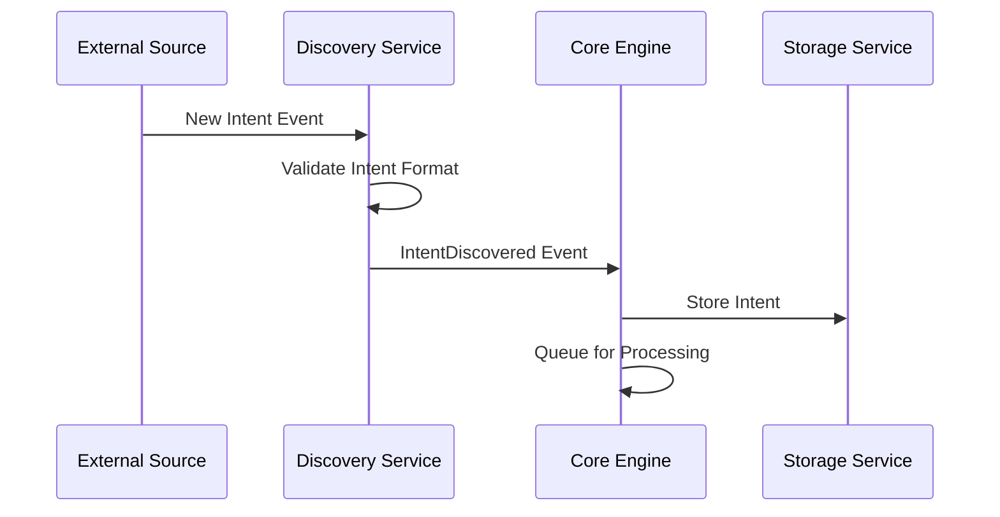
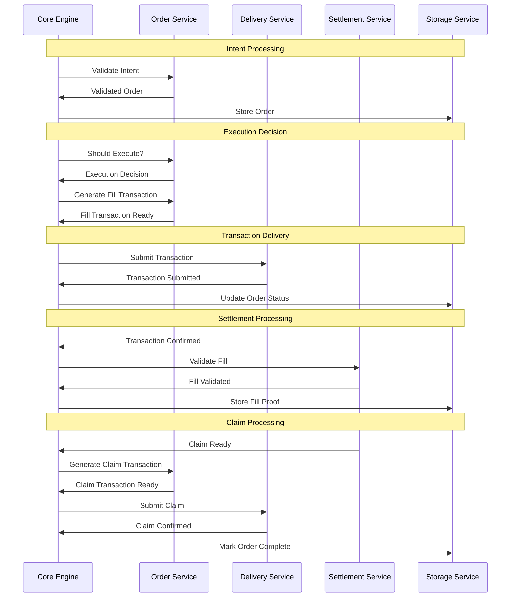
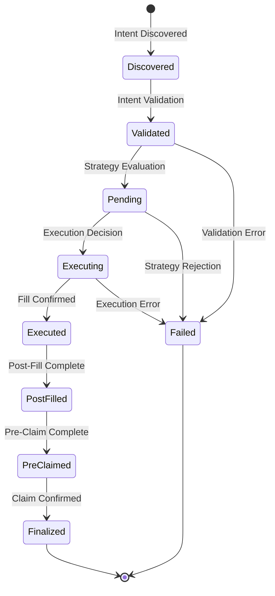

# Architecture Guide

This document provides a comprehensive overview of the OIF Solver's architecture, design principles, and how the different components work together to enable cross-chain intent execution.

## Design Principles

### Modular Architecture

The OIF Solver is built as a collection of loosely-coupled, specialized components. Each component has a single responsibility and communicates with others through well-defined interfaces. This approach provides:

- **Maintainability**: Individual components can be developed, tested, and debugged in isolation
- **Extensibility**: New implementations can be added without modifying existing code
- **Testability**: Each component can be unit tested with mocked dependencies

### Event-Driven Design

All components communicate through a centralized event system, enabling:

- **Asynchronous Processing**: Components don't block each other
- **Loose Coupling**: Components only need to know about events, not other components
- **Scalability**: Easy to add new event handlers and processors
- **Observability**: All interactions are captured as events for monitoring

### Multi-Chain Native

Built from the ground up for cross-chain operations:

- **Concurrent Monitoring**: Simultaneously monitor multiple blockchain networks
- **Chain-Specific Optimizations**: Each network can have tailored configurations
- **Unified Interface**: Consistent API regardless of the underlying blockchain
- **Future-Proof**: Easy to add support for new blockchain networks

## Architectural Decisions and Trade-offs

### Event-Driven vs. Request-Response

**Decision**: Use event-driven architecture for inter-component communication.

**Rationale:**

- Cross-chain operations are inherently asynchronous with variable latency
- Components need to react to blockchain events in real-time
- Enables loose coupling between services for better maintainability

**Trade-offs:**

- **Benefit**: Better scalability and decoupling; easier to add new components
- **Cost**: Increased complexity in tracking state transitions; harder to debug event flows
- **Mitigation**: Comprehensive event logging and state machine visualization

### Pluggable Implementations

**Decision**: Use factory pattern with runtime-configurable implementations.

**Rationale:**

- Support multiple order standards (EIP-7683, EIP-7930, custom protocols)
- Allow different execution strategies without code changes
- Enable testing with mock implementations

**Trade-offs:**

- **Benefit**: Maximum flexibility; easy to extend with new protocols
- **Cost**: Additional abstraction layer; slight runtime overhead from dynamic dispatch
- **Mitigation**: Clear trait boundaries; compile-time type safety where possible

### Storage Strategy

**Decision**: File-based storage with TTL management and planned database support.

**Rationale:**

- Simple deployment without external dependencies
- Sufficient for current scale (hundreds of orders per hour)
- Path to scale via pluggable storage backends

**Trade-offs:**

- **Benefit**: Zero infrastructure dependencies; easy local development
- **Cost**: Limited query capabilities; not suitable for high-frequency operations
- **Mitigation**: Pluggable interface allows migration to databases when needed

### Consistency vs. Availability

**Decision**: Prioritize consistency for order state; availability for discovery.

**Rationale:**

- Order execution requires strict state consistency to prevent double-fills
- Discovery can tolerate brief unavailability without fund loss
- Settlement validation demands deterministic state

**Trade-offs:**

- **Benefit**: Guarantees financial correctness; prevents loss of funds
- **Cost**: May miss opportunities during network partitions
- **Mitigation**: Transaction monitoring with configurable timeouts; graceful degradation

### Monorepo with Multiple Crates

**Decision**: Organize code as a monorepo with separate Rust crates per component.

**Rationale:**

- Enforces clear boundaries between components
- Enables independent testing and compilation
- Facilitates code reuse across different deployment modes

**Trade-offs:**

- **Benefit**: Strong separation of concerns; reusable components
- **Cost**: More complex build configuration; inter-crate dependency management
- **Mitigation**: Workspace-level dependency management; clear versioning strategy

## High-Level Architecture

## Component Architecture

### Core Engine (solver-core)

The orchestration layer that coordinates all other components.

**Responsibilities:**

- Event-driven workflow orchestration
- Order state management and transitions
- Component lifecycle management
- Error handling and recovery
- Graceful shutdown coordination

**Event Flow:**

1. Receives events from discovery services
2. Routes events to appropriate handlers
3. Manages order state transitions
4. Coordinates multi-step operations

### Discovery Layer (solver-discovery)

Monitors various sources for new cross-chain intents.

**Discovery Sources:**

- **On-Chain Discovery**: Monitors blockchain events for intent submissions
- **Off-Chain Discovery**: Receives intents via REST API endpoints
- **Future Sources**: Extensible to support new discovery mechanisms

### Service Layer

#### Order Service (solver-order)

Handles intent validation, execution strategy evaluation, and transaction generation.

**Order Lifecycle:**

1. **Validation**: Parse and validate intent data
2. **Strategy Evaluation**: Determine optimal execution timing
3. **Transaction Generation**: Create blockchain transactions
4. **State Updates**: Track order progress

#### Delivery Service (solver-delivery)

Manages reliable transaction submission (alloy-implementation) and monitoring across multiple blockchain networks.

**Features:**

- Multi-chain transaction submission
- Confirmation monitoring with configurable depth
- Gas estimation and pricing
- Transaction status tracking

#### Settlement Service (solver-settlement)

Handles post-execution settlement verification and claim processing.

**Settlement Flow:**

1. **Fill Validation**: Verify transaction execution and extract proofs
2. **Dispute Period Monitoring**: Wait for required settlement windows
3. **Claim Generation**: Create claim transactions when ready
4. **Oracle Verification**: Validate cross-chain proofs

### Infrastructure Layer

#### Storage Service (solver-storage)

Provides persistent state management with TTL support.

**Features:**

- Configurable TTL for different data types
- Automatic cleanup of expired data
- Multiple backend implementations (file, future: database)
- Atomic operations for critical data

#### Account Service (solver-account)

Manages cryptographic keys and signing on-chain operations.

**Security Features:**

- Secure key storage and handling
- Multiple account support
- Per-network account mapping

#### Config Service (solver-config)

Provides centralized configuration management with validation and environment variable support.

**Features:**

- TOML-based configuration files
- Environment variable substitution with defaults
- Modular configuration via file includes
- Comprehensive validation of all settings
- Support for network, account, storage, and service configurations

#### Pricing Service (solver-pricing)

Manages asset pricing and currency conversions for profitability calculations.

**Features:**

- Pluggable pricing oracle implementations (CoinGecko, mock)
- Multi-hop currency conversions (e.g., ETH → USD → SOL)
- Wei to fiat currency conversions
- Configurable commission and buffer rates
- Trading pair support and validation

#### Type System (solver-types)

Provides shared type definitions and utilities used across all solver components.

**Key Types:**

- **Events**: Inter-service communication structures
- **Orders**: Intent and order data models
- **Networks**: Chain configuration and token definitions
- **Storage**: Persistence layer interfaces
- **Discovery**: Intent source types
- **Standards**: Protocol-specific types (EIP-7683, EIP-7930)
- **Validation**: Configuration schema traits

#### Application Service (solver-service)

Complete solver application that integrates all components into a runnable service.

**Features:**

- HTTP REST API for quote generation and intent submission
- Authentication and authorization middleware
- EIP-712 signature validation
- Rate limiting and CORS support
- Concurrent solver engine and API server execution
- Factory-based component initialization from configuration

## Data Flow Architecture

### Intent Discovery Flow

### Order Processing Flow

## State Management

### Order State Machine

Orders progress through defined states with clear transitions:

**State Descriptions:**

- **Discovered**: Intent received but not yet processed
- **Validated**: Intent successfully parsed and validated
- **Pending**: Awaiting execution decision from strategy
- **Executing**: Fill transaction in progress
- **Executed**: Fill transaction confirmed
- **PostFilled**: Post-fill processing completed
- **PreClaimed**: Pre-claim transaction completed (if required)
- **Finalized**: Order fully completed with claim
- **Failed**: Order failed at some stage

## System Boundaries and Integration Points

### External Dependencies

The OIF Solver system relies on several external components and services:

**Blockchain Networks:**

- **RPC Providers**: HTTP/WebSocket endpoints for blockchain interaction
- **Integration**: Configurable per network with failover support
- **Responsibility**: Transaction submission, event monitoring, state queries

**Price Oracles:**

- **CoinGecko API**: Real-time asset pricing data
- **Integration**: HTTP REST API for currency conversions
- **Responsibility**: External to the solver; used for profitability calculations

**Storage Backends:**

- **File System**: Current implementation for persistent state
- **Future**: Database backends (PostgreSQL, Redis)
- **Responsibility**: Order state, transaction receipts, proofs

### System Boundaries

**Inside the Solver:**

- Intent discovery and validation
- Execution strategy evaluation
- Transaction generation and signing
- Cross-chain settlement coordination
- State management and persistence
- Profitability calculations

**Outside the Solver:**

- Intent origination (submitted by users/applications)
- Blockchain consensus and finality
- Asset price discovery
- Oracle proof generation
- Cross-chain message verification

### Integration APIs

**Inbound Interfaces:**

- **REST API**: HTTP endpoints for intent submission and quotes (solver-service)
- **On-Chain Events**: Smart contract event monitoring (solver-discovery)
- **WebSocket**: Real-time event streaming from blockchain networks

**Outbound Interfaces:**

- **JSON-RPC**: Blockchain transaction submission and queries
- **HTTP REST**: Price oracle data fetching
- **File I/O**: Persistent state storage

## Error Handling Strategy

### Layered Error Handling

1. **Component Level**: Each component handles its specific errors
2. **Service Level**: Services aggregate and transform component errors
3. **Core Level**: Core engine handles workflow errors and recovery
4. **Application Level**: Top-level error handling for unrecoverable errors

This architecture provides a solid foundation for reliable, scalable cross-chain intent execution while remaining flexible for future requirements and enhancements.
