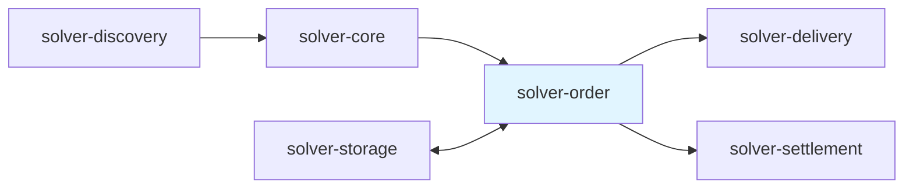

## Overview

The `solver-order` crate serves as the business logic layer for intent processing within the OIF Solver system. It bridges the gap between raw intent discovery and transaction execution by handling validation, applying execution strategies, and generating blockchain transactions for order fulfillment.

### Core Responsibilities

**Intent Validation**: Transforms raw intent data into validated orders by parsing protocol-specific formats, verifying signatures, checking timestamps, and validating cross-chain oracle routes.

**Execution Strategy Evaluation**: Determines when and how orders should be executed based on market conditions, gas prices, solver balances, and profitability thresholds. Strategies can defer execution when conditions are unfavorable or skip orders entirely.

**Transaction Generation**: Creates the complete set of blockchain transactions required for order lifecycle management: prepare transactions for off-chain orders, fill transactions for order execution, and claim transactions for reward settlement.

The crate is designed for extensibility across different order standards through a trait-based abstraction. Currently implements EIP-7683 cross-chain intents, with a clean extension point for additional protocols. Each standard provides its own validation logic, transaction encoding, and protocol-specific requirements.

### Position in the Solver Architecture

The order service sits between the core orchestration engine and the delivery service. It receives validated intents from solver-core, processes them through its validation and strategy pipeline, and generates transactions that solver-delivery submits to blockchains. It also coordinates with solver-settlement to handle post-fill operations and reward claiming.



## Core Abstractions and Traits

### OrderInterface Trait

The `OrderInterface` trait defines the contract that all order standard implementations must fulfill. It provides the essential operations for processing orders from validation through execution to settlement.

**Configuration Schema**

```rust
fn config_schema(&self) -> Box<dyn ConfigSchema>

```

Each implementation defines its own configuration requirements with validation rules. The schema ensures that TOML configuration is valid before the order processor initializes.

**Prepare Transaction Generation**

```rust
async fn generate_prepare_transaction(
    &self,
    source: &str,
    order: &Order,
    params: &ExecutionParams,
) -> Result<Option<Transaction>, OrderError>

```

Generates transactions to prepare orders for filling when needed. For off-chain orders, this typically involves calling an `openFor()` function to register the order on-chain. On-chain orders return `None` since they're already registered. See the [EIP-7683 Implementation](#eip-7683-implementation) section for a concrete example of prepare transaction generation.

**Fill Transaction Generation**

```rust
async fn generate_fill_transaction(
    &self,
    order: &Order,
    params: &ExecutionParams,
) -> Result<Transaction, OrderError>

```

Creates the blockchain transaction that executes the order fill on the destination chain. This transaction transfers assets to the recipient according to the order specification. See the [EIP-7683 Implementation](#eip-7683-implementation) section for a concrete example of fill transaction generation.

**Claim Transaction Generation**

```rust
async fn generate_claim_transaction(
    &self,
    order: &Order,
    fill_proof: &FillProof,
) -> Result<Transaction, OrderError>

```

Generates the transaction to claim rewards on the origin chain after successful order fulfillment. Uses oracle attestation proofs to verify the fill occurred. See the [EIP-7683 Implementation](#eip-7683-implementation) section for a concrete example of claim transaction generation.

**Order Validation**

```rust
async fn validate_order(&self, order_bytes: &Bytes) -> Result<StandardOrder, OrderError>

```

Validates raw order bytes by decoding to the protocol's standard format and checking business rules. Verifies expiration times, fill deadlines, and cross-chain oracle route compatibility.

**Order Creation with ID Computation**

```rust
async fn validate_and_create_order(
    &self,
    order_bytes: &Bytes,
    intent_data: &Option<serde_json::Value>,
    lock_type: &str,
    order_id_callback: OrderIdCallback,
    solver_address: &Address,
    quote_id: Option<String>,
) -> Result<Order, OrderError>

```

Performs complete order validation and creates a generic `Order` with a computed order ID. The order ID callback allows the system to compute unique identifiers by simulating on-chain order ID generation. This method preserves sponsor and signature information from intent data when available.

### ExecutionStrategy Trait

The `ExecutionStrategy` trait defines how solvers make execution decisions based on current market conditions and order characteristics.

**Configuration Schema**

```rust
fn config_schema(&self) -> Box<dyn ConfigSchema>

```

Strategies define their own configuration parameters. The simple strategy, for example, configures a maximum gas price threshold.

**Execution Decision Logic**

```rust
async fn should_execute(&self, order: &Order, context: &ExecutionContext) -> ExecutionDecision
```

Determines whether an order should be executed immediately, deferred to a later time, or skipped entirely. Returns an `ExecutionDecision` enum:

- `Execute(ExecutionParams)`: Execute now with specific gas parameters
- `Defer(Duration)`: Wait and reevaluate after the specified duration
- `Skip(String)`: Don't execute, with a reason explaining why

The execution context provides real-time data:

- Chain gas prices across all networks
- Solver token balances by chain and token
- Current timestamp

### OrderService

The `OrderService` coordinates between different order standard implementations and applies the configured execution strategy.

```rust
pub struct OrderService {
    implementations: HashMap<String, Box<dyn OrderInterface>>,
    strategy: Box<dyn ExecutionStrategy>,
}
```

**Standard-Based Routing**

When processing an order, the service routes to the appropriate implementation based on the order's standard field. Each order specifies its protocol (e.g., "eip7683"), and the service dispatches to the corresponding registered implementation.

**Strategy Application**

```rust
pub async fn should_execute(
    &self,
    order: &Order,
    context: &ExecutionContext,
) -> ExecutionDecision
```

Applies the configured strategy to determine execution timing. The strategy evaluates gas prices, balance requirements, and other conditions to make intelligent execution decisions.

**Transaction Generation Methods**

The service provides unified methods that delegate to the appropriate implementation:

```rust
generate_prepare_transaction(source, order, params) -> Option<Transaction>
generate_fill_transaction(order, params) -> Transaction
generate_claim_transaction(order, proof) -> Transaction
```

**Validation Methods**

```rust
validate_order(standard, order_bytes) -> StandardOrder
validate_and_create_order(standard, order_bytes, ...) -> Order
```

These methods route validation requests to the correct implementation and handle order creation with proper ID computation.

## Integration Architecture

### Order Lifecycle in the Solver System

The order service participates in a multi-stage lifecycle managed by solver-core:

**Stage 1: Intent Discovery to Order Validation**

When an intent arrives, solver-core calls `validate_and_create_order()` on the order service. The service validates the raw intent data (checking format, oracle routes, timestamps), computes a unique order ID, and returns a generic `Order` structure that the core stores with `OrderPending` status.

**Stage 2: Execution Strategy Evaluation**

The core engine regularly evaluates pending orders by calling `should_execute()`. The order service delegates to its configured strategy, which examines market conditions (gas prices, solver balances) and returns one of three decisions:

- `Execute`: Proceed with execution immediately
- `Defer`: Retry after a specified duration
- `Skip`: Abandon the order with a reason

Based on this decision, the core either proceeds with execution, schedules a retry, or marks the order as skipped.

**Stage 3: Transaction Generation**

When execution is approved, the core requests transaction generation from the order service. For off-chain orders, it first generates and submits a prepare transaction to register the order on-chain. Then it generates the fill transaction that executes the order on the destination chain. The specific transaction encoding depends on the order standard implementation.

**Stage 4: Settlement and Claim**

After the fill is confirmed and any dispute period passes, solver-settlement notifies the core that claiming is ready. The core requests a claim transaction from the order service, which generates a transaction to finalize the order and claim rewards on the origin chain. The claiming mechanism varies by protocol standard.

### Data Flow and Transformations

**Intent to Order Transformation**

```
Raw Intent Data (JSON/Bytes)
  |
  v
[OrderInterface::validate_and_create_order]
  |
  +-> Parse order bytes to protocol-specific format
  +-> Validate business rules (expiration, deadlines)
  +-> Check oracle route compatibility
  +-> Compute order ID via callback
  +-> Extract chain and settler information
  |
  v
Generic Order Structure
  |
  +-> id: Unique order identifier
  +-> standard: Protocol name (e.g., "eip7683")
  +-> status: OrderStatus enum
  +-> data: Protocol-specific JSON data
  +-> input_chains: Origin chain settler info
  +-> output_chains: Destination chain settler info
  +-> solver_address: Address for rewards

```

The transformation creates a protocol-agnostic `Order` structure that the core engine and other services can work with uniformly, while preserving protocol-specific details in the `data` field.

**Order to Transaction Transformation**

```
Order + ExecutionParams
  |
  v
[OrderInterface::generate_fill_transaction]
  |
  +-> Extract order data (inputs, outputs)
  +-> Identify destination chain
  +-> Build protocol-specific calldata
  +-> Encode solver information
  |
  v
Transaction
  |
  +-> to: Destination settler contract
  +-> data: ABI-encoded function call
  +-> value: ETH value (typically 0)
  +-> chain_id: Target blockchain
  +-> gas_limit: Optional override

```

Transaction generation encodes all order details into blockchain-specific transactions ready for submission.

### Configuration and Initialization

**Factory Registry Pattern**

The crate uses a factory registry pattern for extensibility:

```rust
pub type OrderFactory = fn(
    &toml::Value,
    &NetworksConfig,
    &OracleRoutes,
) -> Result<Box<dyn OrderInterface>, OrderError>;

pub type StrategyFactory = fn(
    &toml::Value
) -> Result<Box<dyn ExecutionStrategy>, StrategyError>;

```

Each implementation provides a factory function that constructs an instance from configuration:

```rust
pub fn get_all_order_implementations() -> Vec<(&'static str, OrderFactory)> {
    vec![
        ("eip7683", crate::implementations::standards::_7683::create_order_impl)
    ]
}

pub fn get_all_strategy_implementations() -> Vec<(&'static str, StrategyFactory)> {
    vec![
        ("simple", crate::implementations::strategies::simple::create_strategy)
    ]
}

```

**Configuration Structure**

```toml
[order]
# Order standard implementations
[order.implementations.eip7683]
# No specific config needed - uses networks config

# Execution strategy
[order.strategy]
primary = "simple"

[order.strategy.implementations.simple]
max_gas_price_gwei = 100

```

The solver-config crate loads this configuration and uses the factory functions to instantiate the order service with the appropriate implementation and strategy.

## Generic Order Processing Flows

### Order Validation Flow

The validation process ensures orders are properly formed and executable before commitment. Each order standard implementation provides its own validation logic through the `validate_order()` method, which typically includes these key steps:

1. **ABI Decoding**: Verifies the raw bytes conform to the protocol's ABI structure
2. **Timestamp Validation**: Checks that current time is before order expiration and fill deadlines
3. **Oracle Route Validation**: Validates that the order's oracle routes are supported in the system configuration
4. **Cross-Chain Compatibility**: Ensures that cross-chain outputs have valid oracle routes and are compatible with the input oracle configuration

Validation errors return descriptive messages with context to help diagnose issues. For a concrete example of validation implementation, see the [EIP-7683 Implementation](#eip-7683-implementation) section below.

### Execution Strategy Evaluation

The simple strategy provides gas-based and balance-based execution logic with three types of decisions:

1. **Defer**: Gas prices exceed threshold - wait 60 seconds and retry later
2. **Skip**: Insufficient balance or missing information - abandon order with descriptive reason
3. **Execute**: All conditions met - proceed with execution using current gas parameters

**Evaluation Process**

1. Get maximum gas price across all chains from execution context
2. If gas price exceeds configured threshold, return `Defer(60s)`
3. Parse order data to extract requested outputs
4. For each output:
   - Extract chain ID and token address from asset
   - Build balance lookup key `(chain_id, token_address)`
   - Look up solver's balance from execution context
   - If balance info missing, return `Skip("No balance information")`
   - If balance insufficient, return `Skip("Insufficient balance: have X need Y")`
5. If all checks pass, return `Execute` with gas price from context and 2 gwei priority fee

The execution context provides pre-fetched balances to avoid repeated RPC calls during evaluation.

## EIP-7683 Implementation

This section describes the concrete implementation of the OrderInterface trait for the EIP-7683 cross-chain intent standard. The implementation is located in `src/implementations/standards/_7683.rs` and provides all the protocol-specific logic for validating, preparing, filling, and claiming EIP-7683 orders.

### Overview

The `Eip7683OrderImpl` struct implements the `OrderInterface` trait for EIP-7683 cross-chain orders. It manages interactions with both input (origin chain) and output (destination chain) settler contracts to facilitate cross-chain order execution.

**Key Components:**

- **Networks Configuration**: Stores settler contract addresses for each supported blockchain
- **Oracle Routes**: Validates cross-chain oracle compatibility for order execution
- **Lock Type Support**: Handles three different asset lock mechanisms (Permit2, EIP-3009, Resource Lock)

**Order Lifecycle Operations:**

1. **Prepare**: For off-chain escrow orders, creates on-chain order via `openFor()`
2. **Fill**: Executes order on destination chain via output settler's `fill()`
3. **Claim**: Claims rewards on origin chain via `finaliseSelf()` or `finalise()`

### Lock Type Mechanisms

EIP-7683 supports multiple lock mechanisms for securing assets during order execution. The implementation handles two primary patterns: escrow-based locks and compact resource locks.

**Escrow Flow (Permit2 and EIP-3009)**

1. **Prepare Phase** (off-chain orders only): User signs order with Permit2/EIP-3009 authorization and submits to solver. Solver calls `openFor()` on input settler, which locks user tokens in escrow contract.
2. **Fill Phase**: Solver calls `fill()` on output settler with order ID, output details, and filler data. Output settler transfers tokens to recipient on destination chain.
3. **Claim Phase**: After oracle attestation confirms the fill, solver calls `finaliseSelf()` on input settler with order data and solve params. Input settler verifies attestation and releases escrowed tokens plus rewards to solver.

**Compact Resource Lock Flow**

1. **No Prepare Phase**: User creates resource lock directly on-chain via input settler compact contract. No off-chain signature is needed for preparation.
2. **Fill Phase**: Same as escrow - solver calls `fill()` on output settler to execute the order.
3. **Claim Phase**: Solver calls `finalise()` with additional compact signatures parameter. Input settler verifies both compact signatures and oracle attestation before releasing resources and rewards.

**Lock Type Determination**

The implementation defines three lock types via an enum:

```rust
pub enum LockType {
    Permit2Escrow = 1,    // Uses Permit2 for token authorization
    Eip3009Escrow = 2,    // Uses EIP-3009 transferWithAuthorization
    ResourceLock = 3,     // Compact protocol resource locks
}
```

The lock type determines which settler contract to use and how to encode transactions:

```rust
pub fn get_settler_address(&self, chain_id: u64, lock_type: LockType) -> Result<Address> {
    match lock_type {
        LockType::ResourceLock => {
            network.input_settler_compact_address // Compact settler
        },
        LockType::Permit2Escrow | LockType::Eip3009Escrow => {
            network.input_settler_address // Standard escrow settler
        },
    }
}
```

### Validation Rules

The EIP-7683 implementation provides comprehensive validation in the `validate_order()` method (src/implementations/standards/\_7683.rs:576-670). Validation ensures orders are properly formed and executable:

**1. ABI Decoding**

Verifies the raw bytes conform to the EIP-7683 `StandardOrder` ABI structure:

```rust
let standard_order = StandardOrder::abi_decode_validate(order_bytes)
```

**2. Timestamp Validation**

Checks that the current time is before both the order expiration and fill deadline:

```rust
if standard_order.expires < current_time {
    return Err(OrderError::ValidationFailed("Order has expired".to_string()));
}
if standard_order.fillDeadline < current_time {
    return Err(OrderError::ValidationFailed("Order fill deadline has passed".to_string()));
}
```

**3. Oracle Route Validation**

Looks up the input oracle in the supported routes configuration and builds a set of supported destination chains:

```rust
let supported_outputs = self.oracle_routes.supported_routes.get(&input_info)
    .ok_or_else(|| OrderError::ValidationFailed(
        format!("Input oracle {:?} on chain {} is not supported", input_oracle, origin_chain)
    ))?;
```

**4. Cross-Chain Compatibility**

For each output in the order, validates that:

- Same-chain outputs are allowed (skipped from cross-chain validation)
- Cross-chain outputs have a supported route from the input oracle
- If an output oracle is specified, it's compatible with the input oracle

Validation errors return descriptive messages with context, such as:

```
"Output oracle 0x... on chain 137 is not compatible with input oracle 0x... on chain 1"
```

### Transaction Generation Details

The transaction generation process transforms validated orders into executable blockchain transactions. Each transaction type has specific encoding requirements for EIP-7683.

**Prepare Transaction Generation**

Only needed for off-chain escrow orders (returns `None` for on-chain or compact resource lock orders). Implementation in `generate_prepare_transaction()` (src/implementations/standards/\_7683.rs:208-274):

1. Extract raw order data, sponsor address, and signature from order
2. Decode bytes into `StandardOrder` structure
3. Encode `openFor(order, sponsor, signature)` call for input settler using ABI:
   ```rust
   let open_for_data = IInputSettlerEscrow::openForCall {
       order: order_struct,
       sponsor: sponsor_address,
       signature: signature_bytes.into(),
   }.abi_encode();
   ```
4. Build transaction with input settler address, encoded calldata, origin chain ID, and gas limit overrides

**Fill Transaction Generation**

Executes the order on the destination chain. Implementation in `generate_fill_transaction()` (src/implementations/standards/\_7683.rs:297-377):

1. Parse order data and find first cross-chain output (error if none found)
2. Get output settler address for destination chain from order's `output_chains`
3. Build `SolMandateOutput` struct with oracle, settler (as bytes32), chain ID, token, amount, and recipient:
   ```rust
   let output_struct = SolMandateOutput {
       oracle: FixedBytes::<32>::from(output.oracle),
       settler: { /* settler address as bytes32 */ },
       chainId: output.chain_id,
       token: FixedBytes::<32>::from(output.token),
       amount: output.amount,
       recipient: FixedBytes::<32>::from(output.recipient),
       call: vec![].into(),
       context: vec![].into(),
   };
   ```
4. Build filler data containing solver address as bytes32
5. Encode `fill(orderId, output, fillDeadline, fillerData)` call:
   ```rust
   let fill_data = IOutputSettlerSimple::fillCall {
       orderId: FixedBytes::<32>::from(order_data.order_id),
       output: output_struct,
       fillDeadline: order_data.fill_deadline,
       fillerData: solver_bytes32,
   }.abi_encode();
   ```
6. Build transaction with output settler address, encoded calldata, destination chain ID, and gas limit overrides

**Claim Transaction Generation**

Finalizes the order on origin chain after fill confirmation. Implementation in `generate_claim_transaction()` (src/implementations/standards/\_7683.rs:399-574):

1. Parse order data and validate it has cross-chain outputs
2. Build inputs array (as `[[U256; 2]]`) and outputs array (as `Vec<SolMandateOutput>`) with settler addresses
3. Construct `StandardOrder` struct from order data:
   ```rust
   let order_struct = StandardOrder {
       user: user_address,
       nonce: order_data.nonce,
       originChainId: order_data.origin_chain_id,
       expires: order_data.expires,
       fillDeadline: order_data.fill_deadline,
       inputOracle: oracle_address,
       inputs,
       outputs,
   };
   ```
4. Build `SolveParams` with filled timestamp and solver address
5. Set destination to solver address for self-claim (rewards go to solver)
6. Encode call based on lock type:
   - **Escrow**: `finaliseSelf(order, solveParams, destination, call)`
   - **Compact**: `finalise(order, signatures, solveParams, destination, call)` with compact signatures from order data
7. Build transaction with input settler address, encoded calldata, origin chain ID, and gas limit overrides

## Extension Points

### Adding a New Order Standard

To support a new order protocol (e.g., EIP-XXXX):

**1. Implement the OrderInterface Trait**

```rust
pub struct EipXxxxOrderImpl {
    networks: NetworksConfig,
    // ... protocol-specific fields
}

#[async_trait]
impl OrderInterface for EipXxxxOrderImpl {
    fn config_schema(&self) -> Box<dyn ConfigSchema> {
        Box::new(EipXxxxOrderSchema)
    }

    async fn generate_prepare_transaction(...) -> Result<Option<Transaction>, OrderError> {
        // Protocol-specific prepare logic
    }

    async fn generate_fill_transaction(...) -> Result<Transaction, OrderError> {
        // Protocol-specific fill logic
    }

    async fn generate_claim_transaction(...) -> Result<Transaction, OrderError> {
        // Protocol-specific claim logic
    }

    async fn validate_order(...) -> Result<StandardOrder, OrderError> {
        // Protocol-specific validation
    }

    async fn validate_and_create_order(...) -> Result<Order, OrderError> {
        // Protocol-specific order creation
    }
}

```

**2. Create a Factory Function**

```rust
pub fn create_order_impl(
    config: &toml::Value,
    networks: &NetworksConfig,
    oracle_routes: &OracleRoutes,
) -> Result<Box<dyn OrderInterface>, OrderError> {
    // Validate config
    EipXxxxOrderSchema::validate_config(config)?;

    // Construct implementation
    let impl = EipXxxxOrderImpl::new(networks.clone(), oracle_routes.clone())?;
    Ok(Box::new(impl))
}
```

**3. Implement the Registry**

```rust
pub struct Registry;

impl solver_types::ImplementationRegistry for Registry {
    const NAME: &'static str = "eipxxxx";
    type Factory = crate::OrderFactory;

    fn factory() -> Self::Factory {
        create_order_impl
    }
}

impl crate::OrderRegistry for Registry {}
```

**4. Register in the Main Library**

```rust
// In lib.rs
pub fn get_all_order_implementations() -> Vec<(&'static str, OrderFactory)> {
    vec![
        ("eip7683", implementations::standards::_7683::Registry::factory()),
        ("eipxxxx", implementations::standards::eipxxxx::Registry::factory()),
    ]
}
```

**5. Add Configuration**

```toml
[order.implementations.eipxxxx]
# Protocol-specific configuration parameters
custom_param = "value"
```

## Error Handling

### OrderError Types

The crate defines specific error types for different failure scenarios:

```rust
pub enum OrderError {
    ValidationFailed(String),      // Invalid format or business rules
    InsufficientBalance,            // Solver lacks required tokens
    CannotSatisfyOrder,             // Order cannot be fulfilled
    InvalidOrder(String),           // Configuration or data issues
}
```

**Usage Patterns**

```rust
// Validation errors with context
if order.expires < current_timestamp() {
    return Err(OrderError::ValidationFailed("Order has expired".to_string()));
}

// Balance checks
if solver_balance < required_amount {
    return Err(OrderError::InsufficientBalance);
}

// Configuration errors
if !networks.contains_key(&chain_id) {
    return Err(OrderError::InvalidOrder(
        format!("Chain {} not configured", chain_id)
    ));
}
```

### StrategyError Types

Strategy-specific errors handle configuration and initialization issues:

```rust
pub enum StrategyError {
    InvalidConfig(String),           // Configuration validation failed
    MissingParameter(String),        // Required parameter not provided
    InitializationFailed(String),    // Strategy setup failed
    ImplementationNotAvailable(String), // Implementation not found
}
```

**Error Propagation**

```rust
pub fn create_strategy(config: &toml::Value) -> Result<Box<dyn ExecutionStrategy>, StrategyError> {
    let schema = SimpleStrategySchema;
    schema
        .validate(config)
        .map_err(|e| StrategyError::InvalidConfig(e.to_string()))?;

    let max_gas_price = config
        .get("max_gas_price_gwei")
        .and_then(|v| v.as_integer())
        .ok_or_else(|| StrategyError::MissingParameter("max_gas_price_gwei".to_string()))?;

    Ok(Box::new(SimpleStrategy::new(max_gas_price as u64)))
}
```

## Related Documentation

- [solver-types](/docs/solvers/crates/solver-types) - Shared data structures, traits, and interfaces used by the order service
- [solver-core](/docs/solvers/crates/solver-core) - Core orchestration engine that manages the order lifecycle
- [solver-storage](/docs/solvers/crates/solver-storage) - Storage service for persisting order data and computing order IDs
- [solver-delivery](/docs/solvers/crates/solver-delivery) - Transaction delivery service that submits generated transactions
- [solver-settlement](/docs/solvers/crates/solver-settlement) - Settlement service for post-fill operations and claiming
- [solver-config](/docs/solvers/crates/solver-config) - Configuration management for order implementations and strategies
