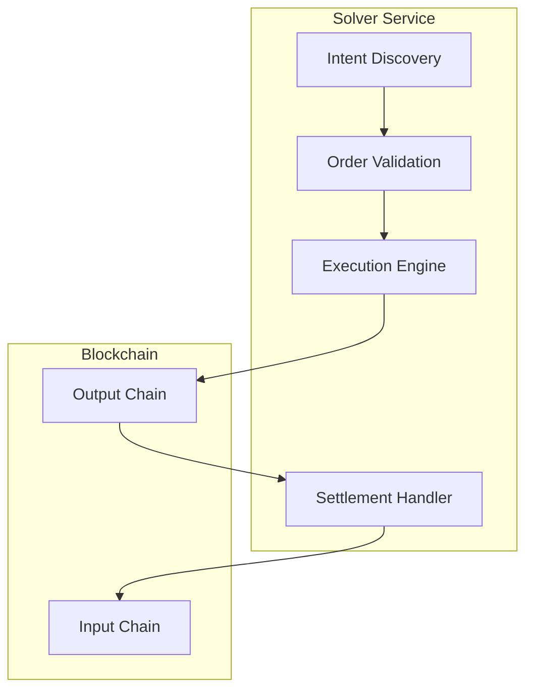

# Solvers

Welcome to the OIF Solvers documentation. Solvers are the execution layer of OIF - autonomous services that compete to fulfill user intents efficiently and profitably.

<Callout type="warn">
This software is in alpha. Use in production environments at your own risk.
</Callout>

## What is a Solver?

Solvers are autonomous services that compete to fulfill user intents efficiently and profitably. When a user expresses an intent (e.g. "I want to swap 100 USDC on Base for ETH on Arbitrum"), solvers discover these intents and handle all the cross-chain complexity on the user's behalf.

## Why Run a Solver?

Running an OIF Solver allows you to:

- **Earn Fees**: Generate revenue by executing cross-chain intents and earning the spread between user quotes and actual execution costs
- **Provide Liquidity**: Facilitate cross-chain operations by providing capital for instant settlement
- **Support the Ecosystem**: Help make cross-chain operations seamless and user-friendly

## Key Features

### Cross-Chain Intent Execution
- Monitor multiple blockchain networks simultaneously for new intent events
- Parse and validate intent data according to EIP-7683 and other supported protocols
- Handle complete settlement including fill verification and claim processing

### Multi-Protocol Support
- **EIP-7683**: Full support for the Cross-Chain Intents Standard
- **Multiple Order Types**: Support for escrow and compact settlement patterns
- **Flexible Authorization**: Permit2, EIP-3009, and other mechanisms

### High Performance
- Built in Rust for maximum efficiency
- Async/await for high concurrency
- Optimized for low-latency execution

## Getting Started

<Cards>
  <Card title="Overview" href="/docs/solvers/overview" description="Learn about solver architecture and how it works" />
  <Card title="Quickstart" href="/docs/solvers/quickstart" description="Run your first solver in minutes" />
  <Card title="Architecture" href="/docs/solvers/architecture" description="Deep dive into solver design and components" />
  <Card title="API Reference" href="/docs/solvers/api-reference" description="Complete API documentation" />
</Cards>

## Architecture Overview

## Use Cases

- **Cross-Chain Asset Transfers**: Enable seamless asset movement between blockchain networks
- **Cross-Chain DeFi Operations**: Facilitate complex DeFi operations spanning multiple chains
- **Liquidity Provision**: Earn fees by providing liquidity for instant cross-chain settlements
- **MEV Opportunities**: Capture value through optimized execution strategies

## Technology Stack

- **Language**: Rust 🦀
- **Runtime**: Tokio async runtime
- **Blockchain**: Ethers-rs for EVM chains
- **Standards**: EIP-7683, EIP-3009, Permit2

## Next Steps

1. Read the [Overview](/docs/solvers/overview) to understand how solvers work
2. Follow the [Quickstart](/docs/solvers/quickstart) to run your first solver
3. Explore the [Architecture](/docs/solvers/architecture) for design details
4. Check the [API Reference](/docs/solvers/api-reference) for implementation details

Ready to start? Head to the [Quickstart Guide](/docs/solvers/quickstart)!

